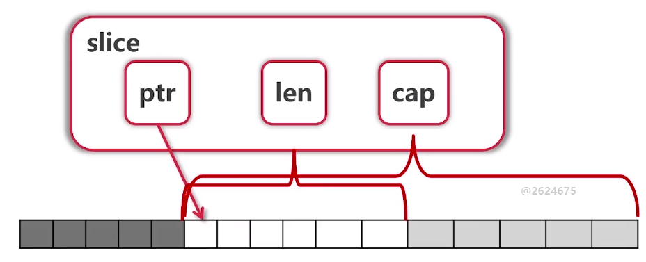
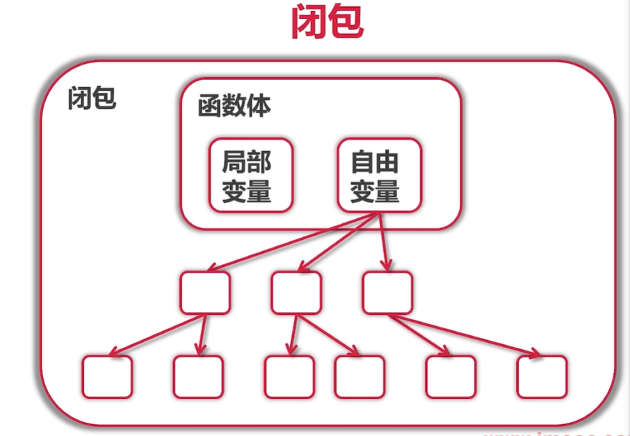

[TOC]


## 1 基础语法

### 变量定义

#### 使用var关键字

##### 使用场景

- 可放在函数内或直接放在包内
- 使用var（）集中定义变量

```go
# 声明变量，不赋初值（默认ZeroValue）
func variableZeroValue() {
	var a int
	var s string
	fmt.Printf("%d %q\n", a, s)
}

# 声明变量，同时赋初值
func variableInitialValue() {
	var a, b int = 3, 4
	var s string = "abc"
	fmt.Println(a, b, s)
}

# 不显示指明变量类型，由编译器自动决定类型（类型推断）
func variableTypeDeduction() {
	var a, b, c, s = 3, 4, true, "def"
	fmt.Println(a, b, c, s)
}
```

#### 短语句赋值

##### 使用场景

- 只能在函数内使用

```go
func variableShorter() {
   a, b, c, s := 3, 4, true, "def"
   b = 5
   fmt.Println(a, b, c, s)
}
```

### 内建变量类型

#### 复数

```go
# 欧拉公式
func euler() {
   fmt.Printf("%.3f\n",
      cmplx.Exp(1i*math.Pi)+1)
}
```

#### 强制类型转换

类型转换是强制的

```go
func triangle() {
	var a, b int = 3, 4
	fmt.Println(calcTriangle(a, b))
}

func calcTriangle(a, b int) int {
	var c int
	c = int(math.Sqrt(float64(a*a + b*b)))
	return c
}
```

### 常量与枚举

#### 常量定义

常量可以作为任意类型使用，不需要强制转换

```go
func consts() {
	const (
		filename = "abc.txt"
		a, b     = 3, 4
	)
	var c int
	c = int(math.Sqrt(a*a + b*b))
	fmt.Println(filename, c)
}
```

#### 枚举定义

```go
func enums() {
   const (
      cpp = iota # 自增
      _
      python
      golang
      javascript
   )

   const (
      b = 1 << (10 * iota)
      kb
      mb
      gb
      tb
      pb
   )

   fmt.Println(cpp, javascript, python, golang)
   fmt.Println(b, kb, mb, gb, tb, pb)
}
```

### 流程控制

#### 条件语句

if条件语句可以进行赋值操作，赋值变量作用域在if语句内

```go
const filename = "abc.txt"
if contents, err := ioutil.ReadFile(filename); err != nil {
    fmt.Println(err)
} else {
    fmt.Printf("%s\n", contents)
}
```

#### 分支语句

- case语句不需要加break
- case语句后面可以不加表达式

```go
func grade(score int) string {
	g := ""
	switch {
	case score < 0 || score > 100:
		panic(fmt.Sprintf(
			"Wrong score: %d", score))
	case score < 60:
		g = "F"
	case score < 80:
		g = "C"
	case score < 90:
		g = "B"
	case score <= 100:
		g = "A"
	}
	return g
}
```

#### 循环语句

- for循环语句可以省略初始条件、结束条件、递增条件

```go
# 十进制数转换成二进制数
func convertToBin(n int) string {
	result := ""
	for ; n > 0; n /= 2 {
		lsb := n % 2
		result = strconv.Itoa(lsb) + result
	}
	return result
}
```

```go
# 打印文件内容
func printFile(filename string) {
	file, err := os.Open(filename)
	if err != nil {
		panic(err)
	}

	printFileContents(file)
}

# 只要实现Reader接口就可以打印
func printFileContents(reader io.Reader) {
	scanner := bufio.NewScanner(reader)

    # for循环省略初始条件和递增条件，与while等价
	for scanner.Scan() {
		fmt.Println(scanner.Text())
	}
}

# 死循环(省略初始条件、结束条件和递增条件)
func forever() {
	for {
		fmt.Println("abc")
	}
}
```

```go
func main() {
	fmt.Println("abc.txt contents:")
	printFile("lang/basic/branch/abc.txt")

	fmt.Println("printing a string:")
	s := `abc"d"
	kkkk
	123

	p`
	printFileContents(strings.NewReader(s))
}
```


### 函数

- 函数可以有多个返回值
- 函数作为入参
- 函数作为返回值
- 可变参数列表
- 没有默认参数、可选参数

```go
func eval(a, b int, op string) (int, error) {
	switch op {
	case "+":
		return a + b, nil
	case "-":
		return a - b, nil
	case "*":
		return a * b, nil
	case "/":
		q, _ := div(a, b)
		return q, nil
	default:
		return 0, fmt.Errorf(
			"unsupported operation: %s", op)
	}
}

func div(a, b int) (q, r int) {
	return a / b, a % b
}
```

```go
# 函数式编程
func apply(op func(int, int) int, a, b int) int {
	return op(a, b)
}

fmt.Println("pow(3, 4) is:", apply(
    func(a int, b int) int {
        return int(math.Pow(
            float64(a), float64(b)))
    }, 3, 4))
```

```go
# 求和
func sum(numbers ...int) int {
	s := 0
	for i := range numbers {
		s += numbers[i]
	}
	return s
}
```

#### 建议

- 函数返回时，显示指定函数返回值名称，函数被调用时会自动提示
- 函数返回时，使用return关键字显示返回（多个）结果

### 指针

- 指针不能运算
- 参数传递时，Go语言只有值传递

## 2 内建容器

### 数组

#### 数组定义

- 数字定义在变量前

```go
# 声明数组 [0 0 0 0 0]
var arr1 [5]int

# 声明并赋值 [1 3 5]
arr2 := [3]int{1, 3, 5}

# 不指定数组大小，声明并赋值
arr3 := [...]int{2, 4, 6, 8, 10}

var grid [4][5]int
```

#### 数组遍历

- for与range结合使用
- 可以通过_省略变量

```go
# 打印数组
func printArray(arr [5]int) {
	arr[0] = 100
	for i, v := range arr {
		fmt.Println(i, v)
	}
}
```

#### 值类型

- 很少使用

### 切片

#### 概念

- slice本身没有数据，只是对底层array的一个view
- slice可以再slice
- slice支持向后扩展，但不可以向前扩展
- 切片操作时，qian不可以超越len(s)，向后扩展时hou不可超越底层数组的cap(s)

#### 实现

  

```go
func updateSlice(s []int) {
	s[0] = 100
}

func main() {
	arr := [...]int{0, 1, 2, 3, 4, 5, 6, 7}
    
    # arr[2:6] = [2 3 4 5]
    # arr[:6] = [0 1 2 3 4 5]
  
	s1 := arr[2:]
	# s1 = [2 3 4 5 6 7]
	s2 := arr[:]
	# s2 = [0 1 2 3 4 5 6 7]

	fmt.Println("After updateSlice(s1)")
	updateSlice(s1)
	fmt.Println(s1)
    # [100 3 4 5 6 7]
	fmt.Println(arr)
    # [0 1 100 3 4 5 6 7]

	fmt.Println("After updateSlice(s2)")
	updateSlice(s2)
	fmt.Println(s2)
    # [100 1 100 3 4 5 6 7]
	fmt.Println(arr)
    # [100 1 100 3 4 5 6 7]

	fmt.Println("Reslice")
    # [100 1 100 3 4 5 6 7]
	s2 = s2[:5]
    # [100 1 100 3 4]
	s2 = s2[2:]
	# [100 3 4]

	fmt.Println("Extending slice")
	arr[0], arr[2] = 0, 2
	fmt.Println("arr =", arr)
    # arr = [0 1 2 3 4 5 6 7]
	s1 = arr[2:6]
    # s1=[2 3 4 5], len(s1)=4, cap(s1)=6
	s2 = s1[3:5] // [s1[3], s1[4]]
	# s2=[5 6], len(s2)=2, cap(s2)=3
    # slice可以向后扩展，但不可以向前扩展

	s3 := append(s2, 10)
    # [5 6 10]
	s4 := append(s3, 11)
    # [5 6 10 11]
	s5 := append(s4, 12)
    # [5 6 10 11 12]
	// s4 and s5 no longer view arr.
	# arr = [0 1 2 3 4 5 6 10]

	// Uncomment to run sliceOps demo.
	// If we see undefined: sliceOps
	// please try go run slices.go sliceops.go
	fmt.Println("Uncomment to see sliceOps demo")
	// sliceOps()
}
```

#### 操作

- 添加元素时如果超越cap，系统会重新分配更大的底层数组
- 由于值传递的关系，添加元素时必须接收append的返回值

```go
func printSlice(s []int) {
	fmt.Printf("%v, len=%d, cap=%d\n",
		s, len(s), cap(s))
}

func sliceOps() {
	fmt.Println("Creating slice")
	var s []int // Zero value for slice is nil

    # 添加元素
	for i := 0; i < 100; i++ {
		printSlice(s)
		s = append(s, 2*i+1)
        # 注意：append会返回一个新的slice
	}
	fmt.Println(s)
	# cap *2自动扩容
    
	s1 := []int{2, 4, 6, 8}
    # [2 4 6 8], len=4, cap=4

    # 声明并赋值
	s2 := make([]int, 16)
    # [0 0 0 0 0 0 0 0 0 0 0 0 0 0 0 0], len=16, cap=16
	s3 := make([]int, 10, 32)
	# [0 0 0 0 0 0 0 0 0 0], len=10, cap=32

    # 拷贝元素
	fmt.Println("Copying slice")
	copy(s2, s1)
	printSlice(s2)
    # [2 4 6 8 0 0 0 0 0 0 0 0 0 0 0 0], len=16, cap=16

    # 删除元素
	fmt.Println("Deleting elements from slice")
	s2 = append(s2[:3], s2[4:]...)
	printSlice(s2)
    # [2 4 6 0 0 0 0 0 0 0 0 0 0 0 0], len=15, cap=16

	fmt.Println("Popping from front")
	front := s2[0]
	s2 = s2[1:]

	fmt.Println(front)
	printSlice(s2)

	fmt.Println("Popping from back")
	tail := s2[len(s2)-1]
	s2 = s2[:len(s2)-1]

	fmt.Println(tail)
	printSlice(s2)
}
```

#### 引用类型

### Map

- Map的key使用hash表存储，必须可比较

#### 操作

```go
func main() {
    # 声明并赋值
	m := map[string]string{
		"name":    "ccmouse",
		"course":  "golang",
		"site":    "imooc",
		"quality": "notbad",
	}

	m2 := make(map[string]int) // m2 == empty map

	var m3 map[string]int // m3 == nil
    # Go语言中的nil参与运算
    
	fmt.Println(m, m2, m3)
	# map[course:golang name:ccmouse quality:notbad site:imooc] map[] map[]
    
	fmt.Println("Traversing map m")
    # map遍历
	for k, v := range m {
		fmt.Println(k, v)
	}

	fmt.Println("Getting values")
    # 查找元素
    # 若key不存在，获取value的值为Zero Value
	courseName := m["course"]
	fmt.Println(`m["course"] =`, courseName)
    
    # 判断key值是否存在
	if causeName, ok := m["cause"]; ok {
		fmt.Println(causeName)
	} else {
		fmt.Println("key 'cause' does not exist")
	}

	fmt.Println("Deleting values")
	name, ok := m["name"]
	fmt.Printf("m[%q] before delete: %q, %v\n",
		"name", name, ok)

    # 删除元素
	delete(m, "name")
	name, ok = m["name"]
	fmt.Printf("m[%q] after delete: %q, %v\n",
		"name", name, ok)
}
```

#### LeetCode真题

寻找最长含有不重复字符的子串

```go
func lengthOfNonRepeatingSubStr(s string) int {
	lastOccurred := make(map[rune]int)
	start := 0
	maxLength := 0

	for i, ch := range []rune(s) {
		if lastI, ok := lastOccurred[ch]; ok && lastI >= start {
			start = lastI + 1
		}
		if i-start+1 > maxLength {
			maxLength = i - start + 1
		}
		lastOccurred[ch] = i
	}

	return maxLength
}
```

#### 引用类型

### 字符和字符串

- 字符串转字符[]rune(s)
- 字符串转字节[]byte(s)
- 使用len(s)获取字节长度
- 使用utf8.RuneCountInString(s)获取字符长度

```go
# 英文字符占1个字节，中文字符占3个字节
func main() {
	s := "Yes我爱慕课网!" // UTF-8
	fmt.Println(s)

    # 打印字符串中的每个字节
	for _, b := range []byte(s) {
		fmt.Printf("%X ", b)
	}
    # 59 65 73 E6 88 91 E7 88 B1 E6 85 95 E8 AF BE E7 BD 91 21 

    # 打印字符串的每个字符的ASCII码
	for i, ch := range s { // ch is a rune
		fmt.Printf("(%d %X) ", i, ch)
	}
    #(0 59) (1 65) (2 73) (3 6211) (6 7231) (9 6155) (12 8BFE) (15 7F51) (18 21) 

	fmt.Println("Rune count:",
		utf8.RuneCountInString(s))
    # Rune count: 9

    # 打印字符串的每个字符
	bytes := []byte(s)
	for len(bytes) > 0 {
		ch, size := utf8.DecodeRune(bytes)
		bytes = bytes[size:]
		fmt.Printf("%c ", ch)
	}
    # Y e s 我 爱 慕 课 网 ! 

     # 打印字符串的每个字符
	for i, ch := range []rune(s) {
		fmt.Printf("(%d %c) ", i, ch)
	}
	# (0 Y) (1 e) (2 s) (3 我) (4 爱) (5 慕) (6 课) (7 网) (8 !) 
}
```

#### 字符串操作

## 3 面向对象

### 结构体和方法

- go语言仅支持封装，不支持继承和多态

#### 结构体的定义

##### Node结构体

```go
type Node struct {
	Value       int
	Left, Right *Node
}

# 值接收者
func (node Node) Print() {
	fmt.Print(node.Value, " ")
}

# 指针接收者
func (node *Node) SetValue(value int) {
	if node == nil {
		fmt.Println("Setting Value to nil " +
			"node. Ignored.")
		return
	}
	node.Value = value
}

# 工厂函数
func CreateNode(value int) *Node {
	return &Node{Value: value}
}
```

##### TreeNode结构体

```go
# 组合方式，扩展已有类型
type myTreeNode struct {
	node *tree.Node
}

# 后序遍历
func (myNode *myTreeNode) postOrder() {
	if myNode == nil || myNode.node == nil {
		return
	}

	left := myTreeNode{myNode.node.Left}
	right := myTreeNode{myNode.node.Right}

	left.postOrder()
	right.postOrder()
	myNode.node.Print()
}

func main() {
    # 声明tree结构体
	var root tree.Node

    # 声明并赋值
	root = tree.Node{Value: 3}
	root.Left = &tree.Node{}
	root.Right = &tree.Node{5, nil, nil}
    
    # 声明并赋值
	root.Right.Left = new(tree.Node)
	root.Left.Right = tree.CreateNode(2)
	root.Right.Left.SetValue(4)

	# 中序遍历
	root.Traverse()

	# 后序遍历
	myRoot := myTreeNode{&root}
	myRoot.postOrder()

    # 使用函数式编程遍历二叉树，并统计节点数量
	nodeCount := 0
	root.TraverseFunc(func(node *tree.Node) {
		nodeCount++
	})
	fmt.Println("Node count:", nodeCount)

    # 使用channel遍历二叉树，并计算出最大值
	c := root.TraverseWithChannel()
	maxNodeValue := 0
	for node := range c {
		if node.Value > maxNodeValue {
			maxNodeValue = node.Value
		}
	}
	fmt.Println("Max node value:", maxNodeValue)
}
```

##### TreeNode遍历

```go
# 中序遍历
func (node *Node) Traverse() {
	node.TraverseFunc(func(n *Node) {
		n.Print()
	})
	fmt.Println()
}

# 使用函数式编程实现中序遍历
# 只管如何遍历树中每个节点，具体对每个节点做什么由传入的函数决定
func (node *Node) TraverseFunc(f func(*Node)) {
	if node == nil {
		return
	}

	node.Left.TraverseFunc(f)
	f(node)
	node.Right.TraverseFunc(f)
}

# 使用channel实现中序遍历
func (node *Node) TraverseWithChannel() chan *Node {
	out := make(chan *Node)
	go func() {
		node.TraverseFunc(func(node *Node) {
			out <- node
		})
		close(out)
	}()
	return out
}
```

#### 结构体的方法

- 语法灵活，本质是Go的语法糖，是否可以简写取决于Go的编译器是否支持
- 值接收者是Go语言特有

##### 值接收者

###### 适用场景

- 不可变结构

##### 指针接收者

- nil指针也可以调用方法，但不可获取结构体内容

###### 适用场景

- 需要改变结构体的内容

##### 值接收者和指针接收者的异同

###### 相同点

- 接收的对象既可以是值也可以是指针

###### 不同点

- 值接收者：接收对象如果是值，方法内则会拷贝一份对象；如果是指针，方法内则会拷贝一份指针所指向的内容。
- 指针接收者：接收对象如果是值，方法内则拷贝一份对象的地址；如果是指针，方法内则拷贝指针本身。

##### 接收者的选择

是否需要使用指针接收者，主要取决于实现方法时，方法调用时只要编译通过即可

##### 结构体方法和普通方法的区别

结构体方法有一个参数叫做接收者，普通方法即函数。

### 包和封装

#### 封装

- 可见性：通过修改变量名、方法名的首字母大小

#### 包

- 同一个目录下可以有多个文件，但只能有一个包
- 可执行程序入口在main包下,main包一般放在外层包下

### 扩展已有类型

- 扩展即新增功能

#### 定义别名

- 为已有类型定义别名，自定义新类型
- 新类型可以复用已有类型的数据结构，也可以定义方法
- 与定义struct相比，更轻量

##### 适用场景

- 不需要原有类型的方法，只需要原有类型的数据结构
- 为新类型自定义方法

##### FIFO队列

使用[]int类型，扩展出自定义类型Queue

```go
package queue

// A FIFO queue.
type Queue []int

// Pushes the element into the queue.
// 		e.g. q.Push(123)
func (q *Queue) Push(v int) {
	*q = append(*q, v)
}

// Pops element from head.
func (q *Queue) Pop() int {
	head := (*q)[0]
	*q = (*q)[1:]
	return head
}

// Returns if the queue is empty or not.
func (q *Queue) IsEmpty() bool {
	return len(*q) == 0
}
```

```go
func main() {
	q := queue.Queue{1}

	q.Push(2)
	q.Push(3)
    fmt.Println([]int(q))
    # 强制类型转换
    
	fmt.Println(q.Pop())
	fmt.Println(q.Pop())
	fmt.Println(q.IsEmpty())
	fmt.Println(q.Pop())
	fmt.Println(q.IsEmpty())
}
```

#### 使用组合

- 已有类型作为成员变量
- 复用已有类型的数据结构及方法

##### 后序遍历

使用treeNode扩展出myTreeNode

#### 使用内嵌

- 写法比较特别
- 思想上类似于继承

##### 适用场景

- 在原有数据类型已有功能上，拓展功能（新增方法）

```go
type myTreeNode struct {
	*tree.Node // Embedding
}

func (myNode *myTreeNode) postOrder() {
	if myNode == nil || myNode.Node == nil {
		return
	}

	left := myTreeNode{myNode.Left}
	right := myTreeNode{myNode.Right}

	left.postOrder()
	right.postOrder()
	myNode.Print()
}

func main() {
	root := myTreeNode{&tree.Node{Value: 3}}
	root.Left = &tree.Node{}
	root.Right = &tree.Node{5, nil, nil}
	root.Right.Left = new(tree.Node)
	root.Left.Right = tree.CreateNode(2)
	root.Right.Left.SetValue(4)

	fmt.Print("In-order traversal: ")
	root.Traverse()

	fmt.Print("My own post-order traversal: ")
	root.postOrder()
	fmt.Println()
}
```

## 依赖管理

依赖管理的三个阶段GOPATH、GOVENDOR、go mod

- go语言都是源码依赖
- go env查看go运行时环境变量
- GO111MODULE =on使用go mod依赖管理
- GOPROXY=https://goproxy.cn,direct 设置国内镜像代理

### GOPATH和GOVENDOR

#### GOPATH

- 不做管理，所有依赖的go源码放在GOPATH/src目录下

```bash
# 结构化日志
go get -u go.uber.org/zap

# web server框架
github.com/gin-gonic/gin
```

#### GOVENDOR

- 项目下新建vendor目录存放第三方库
- 查找依赖的第三方库优先级：vendor目录  >  GOROOT  >  GOPATH

### go mod

- 由go命令统一管理第三方库，用户不必关心目录结构
- 下载的第三方包默认放在GOPATH/pkg/mod目录下
- 在go.mod中使用replace来指向本地目录
- import包时，报的命名规则为module/dictionary

```bash
# 不指定版本时，下载最新的第三方库
go get -u go.uber.org/zap

# 下载指定版本的第三方库
go get -u go.uber.org/zap@v1.12.0

# 清理不再依赖的第三方库
go mod tidy
```

#### 项目迁移go mod

```bash
go mod init
# 构建当前目录及子目录
go bulid ./...
```

## 4 面向接口

### 接口的概念

- 一组行为的抽象

#### 好处

- 接口可以实现模块间松耦合，松到什么程度？你只要给我个东西能调方法就可以，至于你你给的东西到底是什么，我并不关心

### duck typing的概念

大黄鸭是鸭子吗？从duck typing角度来看，大黄鸭是鸭子，因为它走路像鸭子，叫起来像鸭子，长得像鸭子

- 只关心事物的外部行为而非内部结构

#### Go语言中的duck typing

- 有Python duck typing弱类型语言的灵活性
- 有java中的强类型检查

### 接口的定义和实现

- 接口由使用者来定义
- 实现者不需要显示实现接口，只需要实现接口里方法即可

```go
package real

import (
	"net/http"
	"net/http/httputil"
	"time"
)

type Retriever struct {
	UserAgent string
	TimeOut   time.Duration
}

func (r *Retriever) Get(url string) string {
	resp, err := http.Get(url)
	if err != nil {
		panic(err)
	}

	result, err := httputil.DumpResponse(
		resp, true)

	resp.Body.Close()

	if err != nil {
		panic(err)
	}

	return string(result)
}

```

```go
package mock

import "fmt"

type Retriever struct {
	Contents string
}

func (r *Retriever) String() string {
	return fmt.Sprintf(
		"Retriever: {Contents=%s}", r.Contents)
}

func (r *Retriever) Post(url string,
	form map[string]string) string {
	r.Contents = form["contents"]
	return "ok"
}

func (r *Retriever) Get(url string) string {
	return r.Contents
}

```

```go
package main

import (
	"fmt"

	"time"

	"imooc.com/ccmouse/learngo/lang/retriever/mock"
	"imooc.com/ccmouse/learngo/lang/retriever/real"
)

# 定义接口
type Retriever interface {
	Get(url string) string
}

type Poster interface {
	Post(url string,
		form map[string]string) string
}

const url = "http://www.imooc.com"

func download(r Retriever) string {
	return r.Get(url)
}

func post(poster Poster) {
	poster.Post(url,
		map[string]string{
			"name":   "ccmouse",
			"course": "golang",
		})
}

# 接口的组合
type RetrieverPoster interface {
	Retriever
	Poster
}

func session(s RetrieverPoster) string {
	s.Post(url, map[string]string{
		"contents": "another faked imooc.com",
	})
	return s.Get(url)
}

func main() {
	var r Retriever

	mockRetriever := mock.Retriever{
		Contents: "this is a fake imooc.com"}
	r = &mockRetriever
	inspect(r)

	r = &real.Retriever{
		UserAgent: "Mozilla/5.0",
		TimeOut:   time.Minute,
	}
	inspect(r)

	// Type assertion
	if mockRetriever, ok := r.(*mock.Retriever); ok {
		fmt.Println(mockRetriever.Contents)
	} else {
		fmt.Println("r is not a mock retriever")
	}

	fmt.Println(
		"Try a session with mockRetriever")
	fmt.Println(session(&mockRetriever))
}

func inspect(r Retriever) {
	fmt.Println("Inspecting", r)
	fmt.Printf(" > Type:%T Value:%v\n", r, r)
	fmt.Print(" > Type switch: ")
	switch v := r.(type) {
	case *mock.Retriever:
		fmt.Println("Contents:", v.Contents)
	case *real.Retriever:
		fmt.Println("UserAgent:", v.UserAgent)
	}
	fmt.Println()
}
```

### 接口的值类型

- 接口变量可以是实现者的类型，也可以是实现者的指针
- 接口的实现如果是指针接收者，只能以指针方式使用；如果是值接收者，都可以（与struct的方法使用不太一样）

#### type assertion

#### type switch

#### interface{}

- 空接口：该接口没有定义任何方法
- 任意类型：所有类型都实现这个接口
- 通过interface{}实现泛型

### 接口的组合

### 常用的系统接口

- Stringer
- Reader
- Writer

### 多态的实现

#### 面向接口编程

- 一个接口对应多个实现，灵活的选择同一个接口的不同实现给主逻辑

#### 面向对象编程

- 方法的重载
- 方法的重写

## 5 函数式编程

### 函数是一等公民

- 函数可以作为变量
- 函数可以作为另一个函数的参数，将处理逻辑参数化
- 函数可以作为另一个函数的返回值

### 正统的函数式编程

- 不可变性：函数中不能有状态，只能有常量和函数
- 函数只能有一个参数

### 高阶函数

### 闭包



- 函数体内使用的变量+函数打包成一个函数（闭包）

#### 应用

##### 累加器

```go
package main

import "fmt"

func adder() func(int) int {
	sum := 0
	return func(v int) int {
		sum += v
		return sum
	}
}

type iAdder func(int) (int, iAdder)

func adder2(base int) iAdder {
	return func(v int) (int, iAdder) {
		return base + v, adder2(base + v)
	}
}

func main() {
	// a := adder() is trivial and also works.
	a := adder2(0)
	for i := 0; i < 10; i++ {
		var s int
		s, a = a(i)
		fmt.Printf("0 + 1 + ... + %d = %d\n",
			i, s)
	}
}
```

##### 斐波那契数列

```go
package fib

// 1, 1, 2, 3, 5, 8, 13, ...
func Fibonacci() func() int {
	a, b := 0, 1
	return func() int {
		a, b = b, a+b
		return a
	}
}
```

```go
package main

import (
	"bufio"
	"fmt"
	"io"
	"strings"

	"imooc.com/ccmouse/learngo/lang/functional/fib"
)

type intGen func() int

// 比较难以理解
func (g intGen) Read(p []byte) (n int, err error) {
	next := g()
	if next > 10000 {
		return 0, io.EOF
	}
	s := fmt.Sprintf("%d\n", next)

	// TODO: incorrect if p is too small!
	return strings.NewReader(s).Read(p)
}

func printFileContents(reader io.Reader) {
	scanner := bufio.NewScanner(reader)

	for scanner.Scan() {
		fmt.Println(scanner.Text())
	}
}

func main() {
	var f intGen = fib.Fibonacci()
	printFileContents(f)
}

```

##### 二叉树遍历

## 6 错误处理和资源管理

### defer调用

- 确保在函数调用结束后发生
- defer列表先进后出

```go
package main

import (
	"fmt"
	"os"

	"bufio"

	"imooc.com/ccmouse/learngo/lang/functional/fib"
)

func tryDefer() {
	for i := 0; i < 100; i++ {
		defer fmt.Println(i)
		if i == 30 {
			// Uncomment panic to see
			// how it works with defer
			// panic("printed too many")
		}
	}
}

func writeFile(filename string) {
	file, err := os.OpenFile(filename,
		os.O_EXCL|os.O_CREATE|os.O_WRONLY, 0666)

	if err != nil {
		if pathError, ok := err.(*os.PathError); !ok {
			panic(err)
		} else {
			fmt.Printf("%s, %s, %s\n",
				pathError.Op,
				pathError.Path,
				pathError.Err)
		}
		return
	}
	defer file.Close()

	writer := bufio.NewWriter(file)
	defer writer.Flush()

	f := fib.Fibonacci()
	for i := 0; i < 20; i++ {
		fmt.Fprintln(writer, f())
	}
}

func main() {
	tryDefer()
    # 将斐波那契数列写入文件
	writeFile("fib.txt")
}
```

### 服务器统一错误处理

- 思路：最底层往外抛出异常，在最外层对异常处理
- 先通过类型断言判断是否是用户自定义异常，并返回自定义错误信息给前端；然后判断是否是系统异常，再将信息封装放回给前端

#### 查看服务器上的文件

```go
package filelisting

import (
   "fmt"
   "io/ioutil"
   "net/http"
   "os"
   "strings"
)

const prefix = "/list/"

// 自定义用户错误信息
type userError string

func (e userError) Error() string {
   return e.Message()
}

func (e userError) Message() string {
   return string(e)
}

func HandleFileList(writer http.ResponseWriter,
   request *http.Request) error {
   fmt.Println()
   if strings.Index(
      request.URL.Path, prefix) != 0 {
       # 构造userError
      return userError(
         fmt.Sprintf("path %s must start "+
            "with %s",
            request.URL.Path, prefix))
   }
   path := request.URL.Path[len(prefix):]
   file, err := os.Open(path)
   if err != nil {
      return err
   }
   defer file.Close()

   all, err := ioutil.ReadAll(file)
   if err != nil {
      return err
   }

   writer.Write(all)
   return nil
}
```

```go
package main

import (
	"log"
	"net/http"
	_ "net/http/pprof"
	"os"

	"imooc.com/ccmouse/learngo/lang/errhandling/filelistingserver/filelisting"
)

type appHandler func(writer http.ResponseWriter,
	request *http.Request) error

# 包装错误信息
func errWrapper(handler appHandler) func(
	http.ResponseWriter, *http.Request) {
	return func(writer http.ResponseWriter,
		request *http.Request) {
		// panic
		defer func() {
			if r := recover(); r != nil {
				log.Printf("Panic: %v", r)
				http.Error(writer,
					http.StatusText(http.StatusInternalServerError),
					http.StatusInternalServerError)
			}
		}()

		err := handler(writer, request)

		if err != nil {
			log.Printf("Error occurred "+
				"handling request: %s",
				err.Error())

			// user error
			if userErr, ok := err.(userError); ok {
				http.Error(writer,
					userErr.Message(),
					http.StatusBadRequest)
				return
			}

			// system error
			code := http.StatusOK
			switch {
			case os.IsNotExist(err):
				code = http.StatusNotFound
			case os.IsPermission(err):
				code = http.StatusForbidden
			default:
				code = http.StatusInternalServerError
			}
			http.Error(writer,
				http.StatusText(code), code)
		}
	}
}

// 1、实现标准的error接口，可以做类型断言
// 2、Message是给用户看的消息
type userError interface {
	error
	Message() string
}

func main() {
	http.HandleFunc("/",
		errWrapper(filelisting.HandleFileList))

	err := http.ListenAndServe(":8889", nil)
	if err != nil {
		panic(err)
	}
}


```

### panic和recover

#### panic

- 停止当前函数运行
- 一直向上返回，执行每一层的defer
- 如果没有遇见recover,程序退出

#### recover

- 仅在defer调用中使用，用来捕获panic

```go
package main

import (
	"fmt"
)

func tryRecover() {
	defer func() {
		r := recover()
		if r == nil {
			fmt.Println("Nothing to recover. " +
				"Please try uncomment errors " +
				"below.")
			return
		}
		if err, ok := r.(error); ok {
			fmt.Println("Error occurred:", err)
		} else {
			panic(fmt.Sprintf(
				"I don't know what to do: %v", r))
		}
	}()

	// Uncomment each block to see different panic
	// scenarios.
	// Normal error
	//panic(errors.New("this is an error"))

	// Division by zero
	//b := 0
	//a := 5 / b
	//fmt.Println(a)

	// Causes re-panic
	panic(123)
}

func main() {
	tryRecover()
}

```

#### 使用场景

- 意料之中：使用error。例如：文件打不开
- 意料之外：使用panic。例如：数组越界

## 7 测试与性能调优

### 测试

#### 运行测试用例

##### 命令行

```bash
go test .
```

#### 表格驱动测试

##### 实例1

```go
package main

import "testing"

func TestTriangle(t *testing.T) {
	tests := []struct{ a, b, c int }{
		{3, 4, 5},
		{5, 12, 13},
		{8, 15, 17},
		{12, 35, 37},
		{30000, 40000, 50000},
	}

	for _, tt := range tests {
		if actual := calcTriangle(tt.a, tt.b); actual != tt.c {
			t.Errorf("calcTriangle(%d, %d); "+
				"got %d; expected %d",
				tt.a, tt.b, actual, tt.c)
		}
	}
}
```

##### 示例2

```go
package main

import "testing"

func TestSubstr(t *testing.T) {
   tests := []struct {
      s   string
      ans int
   }{
      // Normal cases
      {"abcabcbb", 3},
      {"pwwkew", 3},

      // Edge cases
      {"", 0},
      {"b", 1},
      {"bbbbbbbbb", 1},
      {"abcabcabcd", 4},

      // Chinese support
      {"这里是慕课网", 6},
      {"一二三二一", 3},
      {"黑化肥挥发发灰会花飞灰化肥挥发发黑会飞花", 8},
   }

   for _, tt := range tests {
      actual := lengthOfNonRepeatingSubStr(tt.s)
      if actual != tt.ans {
         t.Errorf("got %d for input %s; "+
            "expected %d",
            actual, tt.s, tt.ans)
      }
   }
}

# 性能测试
func BenchmarkSubstr(b *testing.B) {
   s := "黑化肥挥发发灰会花飞灰化肥挥发发黑会飞花"
   for i := 0; i < 13; i++ {
      s = s + s
   }
   b.Logf("len(s) = %d", len(s))
   ans := 8
    
   # 从当前位置开始计时 
   b.ResetTimer()

   for i := 0; i < b.N; i++ {
      actual := lengthOfNonRepeatingSubStr(s)
      if actual != ans {
         b.Errorf("got %d for input %s; "+
            "expected %d",
            actual, s, ans)
      }
   }
}
```

### 代码覆盖率和性能测试

### 性能调优

### 测试http服务器

```go
package main

import (
	"errors"
	"fmt"
	"io/ioutil"
	"net/http"
	"net/http/httptest"
	"os"
	"strings"
	"testing"
)

func errPanic(_ http.ResponseWriter,
	_ *http.Request) error {
	panic(123)
}

type testingUserError string

func (e testingUserError) Error() string {
	return e.Message()
}

func (e testingUserError) Message() string {
	return string(e)
}

func errUserError(_ http.ResponseWriter,
	_ *http.Request) error {
	return testingUserError("user error")
}

func errNotFound(_ http.ResponseWriter,
	_ *http.Request) error {
	return os.ErrNotExist
}

func errNoPermission(_ http.ResponseWriter,
	_ *http.Request) error {
	return os.ErrPermission
}

func errUnknown(_ http.ResponseWriter,
	_ *http.Request) error {
	return errors.New("unknown error")
}

func noError(writer http.ResponseWriter,
	_ *http.Request) error {
	fmt.Fprintln(writer, "no error")
	return nil
}

var tests = []struct {
	h       appHandler
	code    int
	message string
}{
	{errPanic, 500, "Internal Server Error"},
	{errUserError, 400, "user error"},
	{errNotFound, 404, "Not Found"},
	{errNoPermission, 403, "Forbidden"},
	{errUnknown, 500, "Internal Server Error"},
	{noError, 200, "no error"},
}

func TestErrWrapper(t *testing.T) {
	for _, tt := range tests {
		f := errWrapper(tt.h)
		response := httptest.NewRecorder()
		request := httptest.NewRequest(
			http.MethodGet,
			"http://www.imooc.com", nil)
		f(response, request)

		verifyResponse(response.Result(),
			tt.code, tt.message, t)
	}
}

func TestErrWrapperInServer(t *testing.T) {
	for _, tt := range tests {
		f := errWrapper(tt.h)
		server := httptest.NewServer(
			http.HandlerFunc(f))
		resp, _ := http.Get(server.URL)

		verifyResponse(
			resp, tt.code, tt.message, t)
	}
}

func verifyResponse(resp *http.Response,
	expectedCode int, expectedMsg string,
	t *testing.T) {
	b, _ := ioutil.ReadAll(resp.Body)
	body := strings.Trim(string(b), "\n")
	if resp.StatusCode != expectedCode ||
		body != expectedMsg {
		t.Errorf("expect (%d, %s); "+
			"got (%d, %s)",
			expectedCode, expectedMsg,
			resp.StatusCode, body)
	}
}

```

### 生成文档和示例代码

## 8 Goroutine

### Go语言的调度器

```go
package main

import (
	"fmt"
	"time"
)

func main() {
	for i := 0; i < 1000; i++ {
		go func(i int) {
			for {
				fmt.Printf("Hello from "+
					"goroutine %d\n", i)
			}
		}(i)
	}
	time.Sleep(time.Minute)
}

```

## 9 Channel

- channel读写时阻塞的，当我接收数据时，若没人发送，则会阻塞；反之，若没人接收，发送方也会阻塞。
- 不要通过共享内存来通信，通过通信来共享内存。

### 基本用法

#### 定义channel

#### 从channel中接收数据

- 死循环写法是为了是**一直等待**接收数据，因为循环里是阻塞的，所以并不是一直轮询
- for  range遍历channel时，会从channel中不断接收数据，直到channel被close

#### 关闭channel

- 由发送发关闭
- 不是所有的channel都需要关闭，只有当所有的数据发送完毕，才需要关闭channel

```go
package main

import (
	"fmt"
	"time"
)

func worker(id int, c chan int) {
	for n := range c {
		fmt.Printf("Worker %d received %c\n",
			id, n)
	}
}

func createWorker(id int) chan<- int {
	c := make(chan int)
	go worker(id, c)
	return c
}

func chanDemo() {
	var channels [10]chan<- int
	for i := 0; i < 10; i++ {
		channels[i] = createWorker(i)
	}

	for i := 0; i < 10; i++ {
		channels[i] <- 'a' + i
	}

	for i := 0; i < 10; i++ {
		channels[i] <- 'A' + i
	}

	time.Sleep(time.Millisecond)
}

# 带buffered的channel
func bufferedChannel() {
	c := make(chan int, 3)
	go worker(0, c)
	c <- 'a'
	c <- 'b'
	c <- 'c'
	c <- 'd'
	time.Sleep(time.Millisecond)
}

func channelClose() {
	c := make(chan int)
	go worker(0, c)
	c <- 'a'
	c <- 'b'
	c <- 'c'
	c <- 'd'
	close(c)
	time.Sleep(time.Millisecond)
}

func main() {
	fmt.Println("Channel as first-class citizen")
	chanDemo()
	fmt.Println("Buffered channel")
	bufferedChannel()
	fmt.Println("Channel close and range")
	channelClose()
}
```

### 使用channel等待任务结束

- WaitGroup是一种同步机制，它可以等待一批任务的结束

```go
package main

import (
	"fmt"
	"sync"
)

func doWork(id int,
	w worker) {
	for n := range w.in {
		fmt.Printf("Worker %d received %c\n",
			id, n)
		w.done()
	}
}

type worker struct {
	in   chan int
	done func()
}

func createWorker(
	id int, wg *sync.WaitGroup) worker {
	w := worker{
		in: make(chan int),
		done: func() {
			wg.Done()
		},
	}
	go doWork(id, w)
	return w
}

func chanDemo() {
	var wg sync.WaitGroup

	var workers [10]worker
	for i := 0; i < 10; i++ {
		workers[i] = createWorker(i, &wg)
	}

	wg.Add(20)
	for i, worker := range workers {
		worker.in <- 'a' + i
	}
	for i, worker := range workers {
		worker.in <- 'A' + i
	}

	wg.Wait()
}

func main() {
	chanDemo()
}

```

### 使用channel进行二叉树的遍历

### 使用select进行调度

- for + select  case接收和发送数据，接收数据速度和发送数据速度不一致时，使用队列保存数据
- default套在for循环里的话，需要注意不要产生不阻塞占用cpu的情况
- 尽量所有会阻塞的操作都放在case里
- 分支被选择的条件：有人同时在收发，谁先有数据先调度谁
- channel为nil时，分支无法被选中
- for + default非阻塞实现

```go
package main

import (
	"fmt"
	"math/rand"
	"time"
)

# 模拟不定时的往channel中发送数据
func generator() chan int {
	out := make(chan int)
	go func() {
		i := 0
		for {
			time.Sleep(
				time.Duration(rand.Intn(1500)) *
					time.Millisecond)
			out <- i
			i++
		}
	}()
	return out
}

# 创建channel用于接收数据，并在后台一直等待打印接收道德数据
func worker(id int, c chan int) {
	for n := range c {
		time.Sleep(time.Second)
		fmt.Printf("Worker %d received %d\n",
			id, n)
	}
}

func createWorker(id int) chan<- int {
	c := make(chan int)
	go worker(id, c)
	return c
}

func main() {
	var c1, c2 = generator(), generator()
	var worker = createWorker(0)

	var values []int
    // 计时器
	tm := time.After(10 * time.Second)
    // 定时器
	tick := time.Tick(time.Second)
	for {
		var activeWorker chan<- int
		var activeValue int
		if len(values) > 0 {
			activeWorker = worker
			activeValue = values[0]
		}

		select {
		case n := <-c1:
			values = append(values, n)
		case n := <-c2:
			values = append(values, n)
		case activeWorker <- activeValue:
			values = values[1:]

		case <-time.After(800 * time.Millisecond):
			fmt.Println("timeout")
		case <-tick:
			fmt.Println(
				"queue len =", len(values))
		case <-tm:
			fmt.Println("bye")
			return
		}
	}
}
```

#### 应用场景

- 定时器

### 传统同步机制

- WaitGroup     等待组
- Mutex      互斥量
- Cond     条件

```go
package main

import (
	"fmt"
	"sync"
	"time"
)

type atomicInt struct {
	value int
	lock  sync.Mutex
}

func (a *atomicInt) increment() {
	fmt.Println("safe increment")
	func() {
		a.lock.Lock()
		defer a.lock.Unlock()

		a.value++
	}()
}

func (a *atomicInt) get() int {
	a.lock.Lock()
	defer a.lock.Unlock()

	return a.value
}

func main() {
	var a atomicInt
	a.increment()
	go func() {
		a.increment()
	}()
	time.Sleep(time.Millisecond)
	fmt.Println(a.get())
}
```

### 并发模式

- 生成器
- 服务/任务
- 同时等待多个服务：两种方法（fanIn和select），注意goroutine循环变量的问题

### 并发任务的控制

- 非阻塞等待
- 超时等待
- 任务中断/退出
- 优雅退出

## 10 迷宫的广度有优先搜索

```go
package main

import (
	"fmt"
	"os"
)

func readMaze(filename string) [][]int {
	file, err := os.Open(filename)
	if err != nil {
		panic(err)
	}

	var row, col int
	fmt.Fscanf(file, "%d %d", &row, &col)

	maze := make([][]int, row)
	for i := range maze {
		maze[i] = make([]int, col)
		for j := range maze[i] {
			fmt.Fscanf(file, "%d", &maze[i][j])
		}
	}

	return maze
}

type point struct {
	i, j int
}

var dirs = [4]point{
	{-1, 0}, {0, -1}, {1, 0}, {0, 1}}

func (p point) add(r point) point {
	return point{p.i + r.i, p.j + r.j}
}

func (p point) at(grid [][]int) (int, bool) {
	if p.i < 0 || p.i >= len(grid) {
		return 0, false
	}

	if p.j < 0 || p.j >= len(grid[p.i]) {
		return 0, false
	}

	return grid[p.i][p.j], true
}

func walk(maze [][]int,
	start, end point) [][]int {
	steps := make([][]int, len(maze))
	for i := range steps {
		steps[i] = make([]int, len(maze[i]))
	}

	Q := []point{start}

	for len(Q) > 0 {
		cur := Q[0]
		Q = Q[1:]

		if cur == end {
			break
		}

		for _, dir := range dirs {
			next := cur.add(dir)

			val, ok := next.at(maze)
			if !ok || val == 1 {
				continue
			}

			val, ok = next.at(steps)
			if !ok || val != 0 {
				continue
			}

			if next == start {
				continue
			}

			curSteps, _ := cur.at(steps)
			steps[next.i][next.j] =
				curSteps + 1

			Q = append(Q, next)
		}
	}

	return steps
}

func main() {
	maze := readMaze("lang/maze/maze.in")

	steps := walk(maze, point{0, 0},
		point{len(maze) - 1, len(maze[0]) - 1})

	for _, row := range steps {
		for _, val := range row {
			fmt.Printf("%3d", val)
		}
		fmt.Println()
	}

	// TODO: construct path from steps
}

```

## 11 http及其他标准库

### http标准库

- 使用http客户端发送请求
- 使用http.Client控制请求头部等
- 使用httputil简化工作

### 其他标准库

- bufio
- log
- encoding/json
- regexp
- time
- strings/math/rand

#### 如何查看go doc

```bash
godoc  -http :8888
```

#### JSON数据格式的处理

JSON的数据格式

结构体的tag

JSON Marshal与UnMarshal

#### 第三方API数据格式的解析

#### gin框架介绍

```go
package main

import (
   "github.com/gin-gonic/gin"
   "go.uber.org/zap"
   "math/rand"
   "time"
)

const keyRequestId = "requestId"

func main() {
   r := gin.Default()
   logger, err := zap.NewProduction()
   if err != nil {
      panic(err)
   }

   r.Use(func(c *gin.Context) {
      s := time.Now()

      c.Next()

      logger.Info("incoming request",
         zap.String("path", c.Request.URL.Path),
         zap.Int("status", c.Writer.Status()),
         zap.Duration("elapsed", time.Now().Sub(s)))
   }, func(c *gin.Context) {
      c.Set(keyRequestId, rand.Int())

      c.Next()
   })

   r.GET("/ping", func(c *gin.Context) {
      h := gin.H{
         "message":   "pong",
      }
      if rid, exists := c.Get(keyRequestId); exists {
         h[keyRequestId] = rid
      }
      c.JSON(200, h)
   })
   r.GET("/hello", func(c *gin.Context) {
      c.String(200, "hello")
   })
   r.Run()
}
```

##### gin-gonic/gin

##### middleware的使用

##### context的使用

## 12 实战项目

### 爬虫项目分类

#### 网络爬虫分类

- 通用爬虫：如baidu、google
- 聚焦爬虫：从互联网获取结构化数据

#### go语言的爬虫库/框架

- henrylee2cn/pholcus
- gocrawl
- colly
- hu17889/go_spider

### 爬虫的法律风险

- robots协议
- 技术上没有约束力

### 新爬虫的选择

### 总体算法

## 13 单任务版爬虫

### 获取初始页面

### 正则表达式

#### 获取城市名称和链接

- 使用css选择器
- 使用xpath
- 使用正则表达式

```go
const text = `
my email is ccmouse@gmail.com@abc.com
email1 is abc@def.org
email2 is    kkk@qq.com
email3 is ddd@abc.com.cn
`

func main() {
	re := regexp.MustCompile(
		`([a-zA-Z0-9]+)@([a-zA-Z0-9]+)(\.[a-zA-Z0-9.]+)`)
	match := re.FindAllStringSubmatch(text, -1)
	for _, m := range match {
		fmt.Println(m)
	}
}
```

### 提取城市和URL

### Engine与Parser

#### CityListParser

```go
const cityListRe = `<a href="(http://www.zhenai.com/zhenghun/[0-9a-z]+)"[^>]*>([^<]+)</a>`

func ParseCityList(
   contents []byte) engine.ParseResult {
   re := regexp.MustCompile(cityListRe)
   matches := re.FindAllSubmatch(contents, -1)

   result := engine.ParseResult{}
   limit := 10
   for _, m := range matches {
      result.Items = append(
         result.Items, "City "+string(m[2]))
      result.Requests = append(
         result.Requests, engine.Request{
            Url:        string(m[1]),
            ParserFunc: ParseCity,
         })
      limit--
      if limit == 0 {
         break
      }
   }

   return result
}
```

#### CityListParser测试

```go
func TestParseCityList(t *testing.T) {
   contents, err := ioutil.ReadFile(
      "citylist_test_data.html")

   if err != nil {
      panic(err)
   }

   result := ParseCityList(contents)

   const resultSize = 470
   expectedUrls := []string{
      "http://www.zhenai.com/zhenghun/aba",
      "http://www.zhenai.com/zhenghun/akesu",
      "http://www.zhenai.com/zhenghun/alashanmeng",
   }
   expectedCities := []string{
      "City 阿坝", "City 阿克苏", "City 阿拉善盟",
   }

   if len(result.Requests) != resultSize {
      t.Errorf("result should have %d "+
         "requests; but had %d",
         resultSize, len(result.Requests))
   }
   for i, url := range expectedUrls {
      if result.Requests[i].Url != url {
         t.Errorf("expected url #%d: %s; but "+
            "was %s",
            i, url, result.Requests[i].Url)
      }
   }

   if len(result.Items) != resultSize {
      t.Errorf("result should have %d "+
         "requests; but had %d",
         resultSize, len(result.Items))
   }
   for i, city := range expectedCities {
      if result.Items[i].(string) != city {
         t.Errorf("expected city #%d: %s; but "+
            "was %s",
            i, city, result.Items[i].(string))
      }
   }

}
```

#### CityParser

```go
const cityRe = `<a href="(http://album.zhenai.com/u/[0-9]+)"[^>]*>([^<]+)</a>`

func ParseCity(
   contents []byte) engine.ParseResult {
   re := regexp.MustCompile(cityRe)
   matches := re.FindAllSubmatch(contents, -1)

   result := engine.ParseResult{}
   for _, m := range matches {
      name := string(m[2])
      result.Items = append(
         result.Items, "User "+name)
      result.Requests = append(
         result.Requests, engine.Request{
            Url: string(m[1]),
            # 函数式编程，闭包的使用 
            ParserFunc: func(
               c []byte) engine.ParseResult {
               return ParseProfile(
                  c, name)
            },
         })
   }

   return result
}
```

#### 用户信息解析器

```go
var ageRe = regexp.MustCompile(
   `<td><span class="label">年龄：</span>(\d+)岁</td>`)
var heightRe = regexp.MustCompile(
   `<td><span class="label">身高：</span>(\d+)CM</td>`)
var incomeRe = regexp.MustCompile(
   `<td><span class="label">月收入：</span>([^<]+)</td>`)
var weightRe = regexp.MustCompile(
   `<td><span class="label">体重：</span><span field="">(\d+)KG</span></td>`)
var genderRe = regexp.MustCompile(
   `<td><span class="label">性别：</span><span field="">([^<]+)</span></td>`)
var xinzuoRe = regexp.MustCompile(
   `<td><span class="label">星座：</span><span field="">([^<]+)</span></td>`)
var marriageRe = regexp.MustCompile(
   `<td><span class="label">婚况：</span>([^<]+)</td>`)
var educationRe = regexp.MustCompile(
   `<td><span class="label">学历：</span>([^<]+)</td>`)
var occupationRe = regexp.MustCompile(
   `<td><span class="label">职业：</span><span field="">([^<]+)</span></td>`)
var hokouRe = regexp.MustCompile(
   `<td><span class="label">籍贯：</span>([^<]+)</td>`)
var houseRe = regexp.MustCompile(
   `<td><span class="label">住房条件：</span><span field="">([^<]+)</span></td>`)
var carRe = regexp.MustCompile(
   `<td><span class="label">是否购车：</span><span field="">([^<]+)</span></td>`)

func ParseProfile(
   contents []byte,
   name string) engine.ParseResult {
   profile := model.Profile{}
   profile.Name = name

   age, err := strconv.Atoi(
      extractString(contents, ageRe))
   if err == nil {
      profile.Age = age
   }

   height, err := strconv.Atoi(
      extractString(contents, heightRe))
   if err == nil {
      profile.Height = height
   }

   weight, err := strconv.Atoi(
      extractString(contents, weightRe))
   if err == nil {
      profile.Weight = weight
   }

   profile.Income = extractString(
      contents, incomeRe)
   profile.Gender = extractString(
      contents, genderRe)
   profile.Car = extractString(
      contents, carRe)
   profile.Education = extractString(
      contents, educationRe)
   profile.Hokou = extractString(
      contents, hokouRe)
   profile.House = extractString(
      contents, houseRe)
   profile.Marriage = extractString(
      contents, marriageRe)
   profile.Occupation = extractString(
      contents, occupationRe)
   profile.Xinzuo = extractString(
      contents, xinzuoRe)

   result := engine.ParseResult{
      Items: []interface{}{profile},
   }

   return result
}

func extractString(
   contents []byte, re *regexp.Regexp) string {
   match := re.FindSubmatch(contents)

   if len(match) >= 2 {
      return string(match[1])
   } else {
      return ""
   }
}
```

#### 用户信息解析器测试

```go
func TestParseProfile(t *testing.T) {
   contents, err := ioutil.ReadFile(
      "profile_test_data.html")

   if err != nil {
      panic(err)
   }

   result := ParseProfile(contents, "安静的雪")

   if len(result.Items) != 1 {
      t.Errorf("Items should contain 1 "+
         "element; but was %v", result.Items)
   }

   profile := result.Items[0].(model.Profile)

   expected := model.Profile{
      Age:        34,
      Height:     162,
      Weight:     57,
      Income:     "3001-5000元",
      Gender:     "女",
      Name:       "安静的雪",
      Xinzuo:     "牡羊座",
      Occupation: "人事/行政",
      Marriage:   "离异",
      House:      "已购房",
      Hokou:      "山东菏泽",
      Education:  "大学本科",
      Car:        "未购车",
   }

   if profile != expected {
      t.Errorf("expected %v; but was %v",
         expected, profile)
   }
}
```