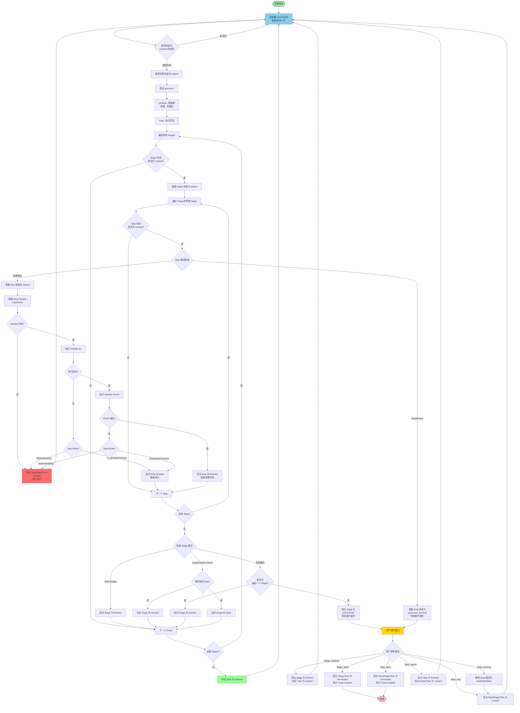
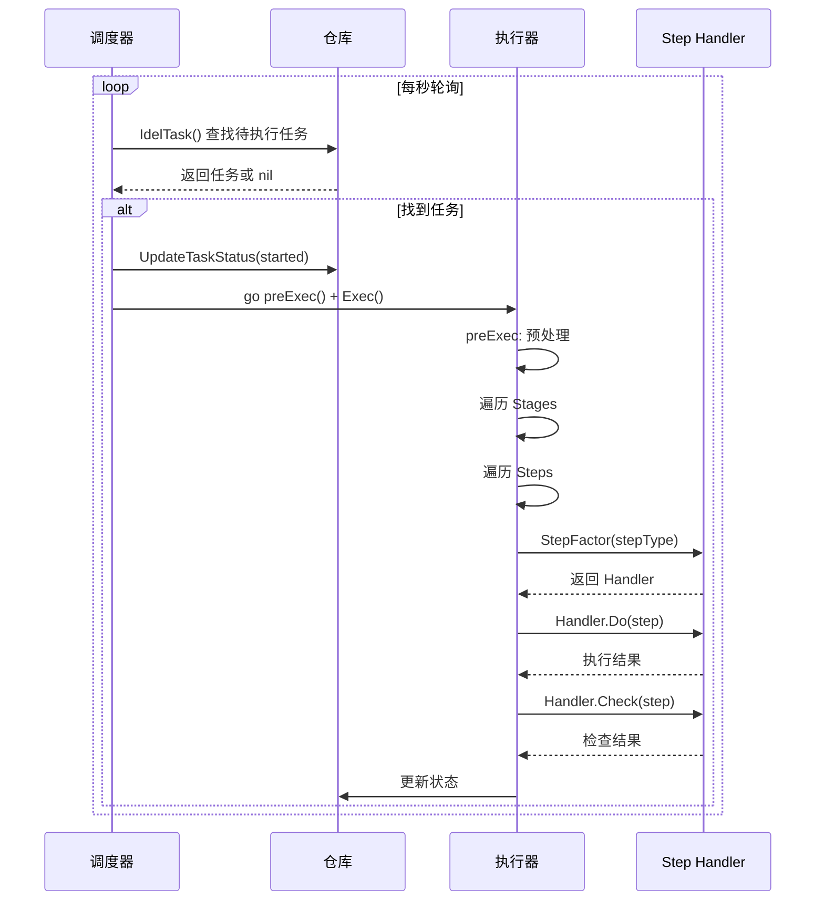
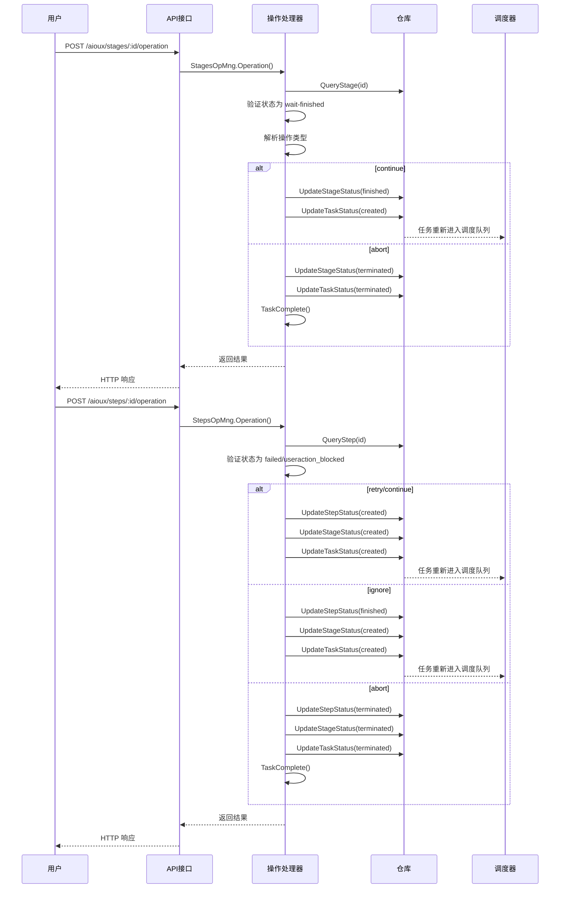
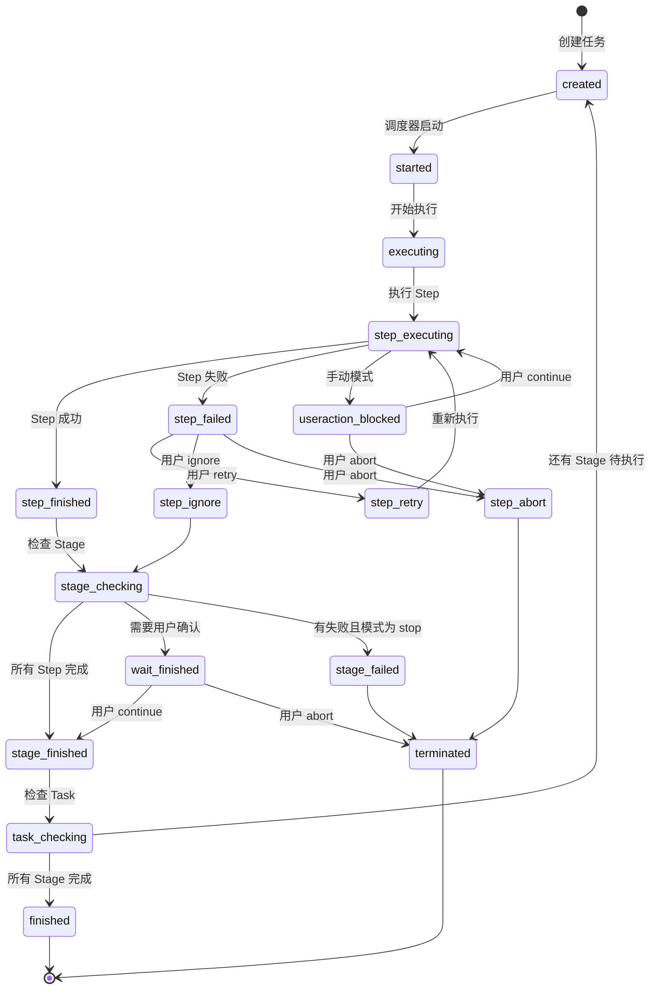

# 任务调度框架流程图

## 完整流程图

```mermaid
graph TB
    Start([系统启动]) --> Sched[调度器 Sched 启动<br/>每秒轮询一次]
    
    Sched --> CheckTask{查找状态为<br/>created 的任务}
    CheckTask -->|未找到| Sched
    CheckTask -->|找到任务| UpdateTask[更新任务状态为 started]
    
    UpdateTask --> GoRoutine[启动 goroutine]
    GoRoutine --> PreExec[preExec: 预处理<br/>清理、初始化]
    PreExec --> Exec[Exec: 执行任务]
    
    Exec --> LoopStages[遍历所有 Stages]
    LoopStages --> CheckStageStatus{Stage 状态<br/>是否为 created?}
    CheckStageStatus -->|否| NextStage[下一个 Stage]
    CheckStageStatus -->|是| UpdateStage[更新 Stage 状态为 started]
    
    UpdateStage --> LoopSteps[遍历 Stage 的所有 Steps]
    LoopSteps --> CheckStepStatus{Step 状态<br/>是否为 created?}
    CheckStepStatus -->|否| NextStep[下一个 Step]
    CheckStepStatus -->|是| CheckStepMode{Step 模式检查}
    
    CheckStepMode -->|StepManual| UserBlocked[更新 Step 状态为<br/>useraction_blocked<br/>等待用户操作]
    CheckStepMode -->|其他模式| UpdateStep[更新 Step 状态为 started]
    
    UpdateStep --> GetHandler[获取 Step Handler<br/>StepFactor]
    GetHandler --> HandlerExists{Handler 存在?}
    HandlerExists -->|否| FailAll[标记 Step/Stage/Task<br/>为 failed<br/>终止执行]
    HandlerExists -->|是| DoHandler[执行 Handler.Do]
    
    DoHandler --> DoSuccess{执行成功?}
    DoSuccess -->|否| CheckMode1{Step.Mode?}
    CheckMode1 -->|StepFailedStop| FailAll
    CheckMode1 -->|StepFailedContinue| MarkStepFailed[标记 Step 为 failed<br/>继续执行]
    
    DoSuccess -->|是| CheckHandler[执行 Handler.Check]
    CheckHandler --> CheckSuccess{Check 通过?}
    CheckSuccess -->|否| CheckMode2{Step.Mode?}
    CheckMode2 -->|StepFailedStop| FailAll
    CheckMode2 -->|StepFailedContinue| MarkStepFailed
    
    CheckSuccess -->|是| MarkStepFinished[标记 Step 为 finished<br/>更新实例状态]
    MarkStepFailed --> NextStep
    MarkStepFinished --> NextStep
    
    NextStep --> MoreSteps{还有 Steps?}
    MoreSteps -->|是| LoopSteps
    MoreSteps -->|否| CheckStageMode{检查 Stage 模式}
    
    CheckStageMode -->|IsAutoStage| MarkStageFinished1[标记 Stage 为 finished]
    CheckStageMode -->|StageFailedContinue| CheckFailedSteps{有失败的 Step?}
    CheckFailedSteps -->|是| MarkStageFailed[标记 Stage 为 failed]
    CheckFailedSteps -->|否| MarkStageFinished2[标记 Stage 为 finished]
    CheckStageMode -->|其他模式| LastStage{是否为<br/>最后一个 Stage?}
    LastStage -->|是| MarkStageFinished3[标记 Stage 为 finished]
    LastStage -->|否| WaitUser[标记 Stage 为<br/>wait-finished<br/>等待用户操作]
    
    MarkStageFinished1 --> NextStage
    MarkStageFinished2 --> NextStage
    MarkStageFinished3 --> NextStage
    MarkStageFailed --> NextStage
    WaitUser --> UserOp[用户操作接口]
    
    NextStage --> MoreStages{还有 Stages?}
    MoreStages -->|是| LoopStages
    MoreStages -->|否| MarkTaskFinished[标记 Task 为 finished]
    
    MarkTaskFinished --> Sched
    FailAll --> Sched
    
    %% 用户操作流程
    UserBlocked --> UserOp
    UserOp --> UserRequest{用户操作类型}
    
    UserRequest -->|Stage: continue| StageContinue[标记 Stage 为 finished<br/>标记 Task 为 created]
    UserRequest -->|Stage: abort| StageAbort[标记 Stage/Task 为 terminated<br/>执行 TaskComplete]
    UserRequest -->|Step: continue| StepContinue[修改 Step 模式为 StepFailedStop]
    UserRequest -->|Step: retry| StepRetry[标记 Step/Stage/Task 为 created]
    UserRequest -->|Step: ignore| StepIgnore[标记 Step 为 finished<br/>标记 Stage/Task 为 created]
    UserRequest -->|Step: abort| StepAbort[标记 Step/Stage/Task 为 terminated<br/>执行 TaskComplete]
    
    StepContinue --> StepRetry
    StageContinue --> Sched
    StepRetry --> Sched
    StepIgnore --> Sched
    StageAbort --> End([结束])
    StepAbort --> End
    
    style Start fill:#90EE90
    style End fill:#FFB6C1
    style Sched fill:#87CEEB
    style UserOp fill:#FFD700
    style FailAll fill:#FF6B6B
    style MarkTaskFinished fill:#98FB98
```

## 调度器核心流程

```mermaid
sequenceDiagram
    participant Sched as 调度器
    participant Repo as 仓库
    participant Exec as 执行器
    participant Handler as Step Handler
    
    loop 每秒轮询
        Sched->>Repo: IdelTask() 查找待执行任务
        Repo-->>Sched: 返回任务或 nil
        
        alt 找到任务
            Sched->>Repo: UpdateTaskStatus(started)
            Sched->>Exec: go preExec() + Exec()
            Exec->>Exec: preExec: 预处理
            Exec->>Exec: 遍历 Stages
            Exec->>Exec: 遍历 Steps
            Exec->>Handler: StepFactor(stepType)
            Handler-->>Exec: 返回 Handler
            Exec->>Handler: Handler.Do(step)
            Handler-->>Exec: 执行结果
            Exec->>Handler: Handler.Check(step)
            Handler-->>Exec: 检查结果
            Exec->>Repo: 更新状态
        end
    end
```

## 用户操作流程

```mermaid
sequenceDiagram
    participant User as 用户
    participant API as API接口
    participant Handler as 操作处理器
    participant Repo as 仓库
    participant Sched as 调度器
    
    User->>API: POST /aioux/stages/:id/operation
    API->>Handler: StagesOpMng.Operation()
    Handler->>Repo: QueryStage(id)
    Handler->>Handler: 验证状态为 wait-finished
    Handler->>Handler: 解析操作类型
    
    alt continue
        Handler->>Repo: UpdateStageStatus(finished)
        Handler->>Repo: UpdateTaskStatus(created)
        Repo-->>Sched: 任务重新进入调度队列
    else abort
        Handler->>Repo: UpdateStageStatus(terminated)
        Handler->>Repo: UpdateTaskStatus(terminated)
        Handler->>Handler: TaskComplete()
    end
    
    Handler-->>API: 返回结果
    API-->>User: HTTP 响应
    
    User->>API: POST /aioux/steps/:id/operation
    API->>Handler: StepsOpMng.Operation()
    Handler->>Repo: QueryStep(id)
    Handler->>Handler: 验证状态为 failed/useraction_blocked
    
    alt retry/continue
        Handler->>Repo: UpdateStepStatus(created)
        Handler->>Repo: UpdateStageStatus(created)
        Handler->>Repo: UpdateTaskStatus(created)
        Repo-->>Sched: 任务重新进入调度队列
    else ignore
        Handler->>Repo: UpdateStepStatus(finished)
        Handler->>Repo: UpdateStageStatus(created)
        Handler->>Repo: UpdateTaskStatus(created)
        Repo-->>Sched: 任务重新进入调度队列
    else abort
        Handler->>Repo: UpdateStepStatus(terminated)
        Handler->>Repo: UpdateStageStatus(terminated)
        Handler->>Repo: UpdateTaskStatus(terminated)
        Handler->>Handler: TaskComplete()
    end
    
    Handler-->>API: 返回结果
    API-->>User: HTTP 响应
```

## 状态转换图

```mermaid
stateDiagram-v2
    [*] --> created: 创建任务
    
    created --> started: 调度器启动
    started --> executing: 开始执行
    
    executing --> step_executing: 执行 Step
    step_executing --> step_finished: Step 成功
    step_executing --> step_failed: Step 失败
    step_executing --> useraction_blocked: 手动模式
    
    step_failed --> step_retry: 用户 retry
    step_failed --> step_ignore: 用户 ignore
    step_failed --> step_abort: 用户 abort
    step_retry --> step_executing: 重新执行
    
    useraction_blocked --> step_executing: 用户 continue
    useraction_blocked --> step_abort: 用户 abort
    
    step_finished --> stage_checking: 检查 Stage
    step_ignore --> stage_checking
    
    stage_checking --> stage_finished: 所有 Step 完成
    stage_checking --> wait_finished: 需要用户确认
    stage_checking --> stage_failed: 有失败且模式为 stop
    
    wait_finished --> stage_finished: 用户 continue
    wait_finished --> terminated: 用户 abort
    
    stage_finished --> task_checking: 检查 Task
    stage_failed --> terminated
    
    task_checking --> finished: 所有 Stage 完成
    task_checking --> created: 还有 Stage 待执行
    
    finished --> [*]
    terminated --> [*]
    step_abort --> terminated
```

