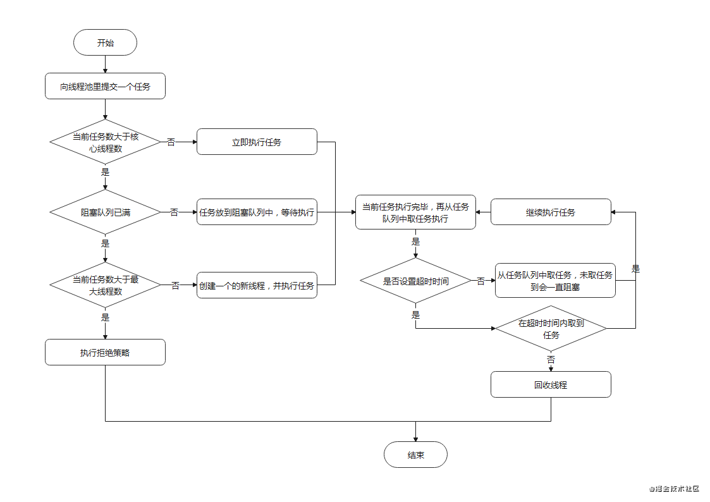

[TOC]

# JAVA基础


# 并发编程

**常见名词**

- JUC
- CAS
- AQS

## 1  线程基础

### 线程创建

1、创建线程有哪几种方式？哪种方式更好？

```java
public void run() {
    if (target != null) {
        target.run();
    }
}
```

### 线程启动

1、Thread#start方法调用两次会怎样？

```java
/**
 * Causes this thread to begin execution; the Java Virtual Machine
 * calls the <code>run</code> method of this thread.
 * <p>
 * The result is that two threads are running concurrently: the
 * current thread (which returns from the call to the
 * <code>start</code> method) and the other thread (which executes its
 * <code>run</code> method).
 * <p>
 * It is never legal to start a thread more than once.
 * In particular, a thread may not be restarted once it has completed
 * execution.
 *
 * @exception  IllegalThreadStateException  if the thread was already
 *               started.
 * @see        #run()
 * @see        #stop()
 */
public synchronized void start() {
    /**
     * This method is not invoked for the main method thread or "system"
     * group threads created/set up by the VM. Any new functionality added
     * to this method in the future may have to also be added to the VM.
     *
     * A zero status value corresponds to state "NEW".
     */
    if (threadStatus != 0)
        throw new IllegalThreadStateException();

    /* Notify the group that this thread is about to be started
     * so that it can be added to the group's list of threads
     * and the group's unstarted count can be decremented. */
    group.add(this);

    boolean started = false;
    try {
        start0();
        started = true;
    } finally {
        try {
            if (!started) {
                group.threadStartFailed(this);
            }
        } catch (Throwable ignore) {
            /* do nothing. If start0 threw a Throwable then
              it will be passed up the call stack */
        }
    }
}
```

2、调用Thread#start方法启动线程和和直接调用Thread#run方法的区别。

### 线程停止

1、如何正确停止线程？

- 请求方：发出中断信号
- 被停止方：响应中断
- 子方法调用方：抛出或恢复中断

### 线程生命周期

## 2  底层原理

### Java内存模型

线程对内存的访问（读写操作）没有统一的规范，会出现**缓存不一致**问题；为了解决这个问题，JVM屏蔽了底层硬件和操作系统的差异，抽象出**主内存**和**工作内存**的概念；Java内存模型主要围绕在并发过程中如何处理**原子性**、**可见性**、**有序性**三大特性展开的，可以解除缓存一致性问题。

#### 特性

- 原子性
- 可见性
- 有序性

### happens-before原则

#### 定义

A happens before B，即A先于B发生，则A的执行结果对B可见。

#### 规则

JMM定义了如下的happens-before原则，已此保证有序性。

- 程序顺序规则：一个线程（单线程）中的每一个操作，happens-before于该线程后续任意操作

- 锁规则：对一个线程的**加锁**happens-before线程的**解锁**

- volatile规则：volatile变量的**写**happens-before volatile变量的**读**

- 传递性：A happens-before B，且B happens-before C，则A happens-before C

### 指令重排序

定义：编译器和处理器为了优化程序性能而对指令进行重新排序。

#### as-if-serial语义

不管指令如何重排序，（单线程）最终的执行结果不能改变。

### volatile关键字

#### 性质

- 可见性
- 禁止指令重排序优化（底层实现是使用**内存屏障**）

#### 使用场景

- 纯赋值操作（i++不适用）
- 作为触发器

## 3  线程安全

多线程竞争共享资源时，需要保证同一时刻有且只有一个线程在操作共享资源

### 并发原子类

### 并发容器

### 锁

#### 分类

| 分类依据                           | 判断结果 | 类型                                       |
| ---------------------------------- | -------- | ------------------------------------------ |
| 是否对资源加锁                     | 是       | 悲观锁                                     |
|                                    | 否       | 乐观锁                                     |
| 不同线程是否可以共享同一把锁       | 可以     | 共享锁                                     |
|                                    | 不可以   | 独占锁                                     |
| 同一个线程是否可以重复获取同一把锁 | 可以     | 可重入锁                                   |
|                                    | 不可以   | 不可重入锁                                 |
| 并发冲突时是否自旋转               | 自旋     | 自旋锁                                     |
|                                    | 阻塞     | 非自旋锁                                   |
| 加锁时是否可中断                   | 可以     | 可中断锁                                   |
|                                    | 不可以   | 不可中断锁                                 |
| 获取锁时是否可以插队               | 可以     | 非公平锁（先尝试插队，如果插队失败再排队） |
|                                    | 不可以   | 公平锁                                     |

#### sychornized

##### 底层原理

###### 对象锁机制

```bash
javap -v xx.class
```

查看java的字节码文件发现，monitorenter和monitorexit两个指令可以理解为执行代码块前的加锁和退出同步代码块时的解锁。

##### 特点

不需要显示释放锁

#### Lock

#### 基于volatile + CAS实现同步锁

#### 死锁问题

##### 死锁的四个必要条件

- 互斥条件
- 请求与保持
- 循环等待

- 不可剥夺

##### 典型案例

###### 银行转账问题

```java
/**
 * 描述：     多人同时转账，依然很危险
 */
public class MultiTransferMoney {

    private static final int NUM_ACCOUNTS = 500;
    private static final int NUM_MONEY = 1000;
    private static final int NUM_ITERATIONS = 1000000;
    private static final int NUM_THREADS = 20;

    public static void main(String[] args) {

        Random rnd = new Random();
        Account[] accounts = new Account[NUM_ACCOUNTS];
        for (int i = 0; i < accounts.length; i++) {
            accounts[i] = new Account(NUM_MONEY);
        }
        class TransferThread extends Thread {

            @Override
            public void run() {
                for (int i = 0; i < NUM_ITERATIONS; i++) {
                    int fromAcct = rnd.nextInt(NUM_ACCOUNTS);
                    int toAcct = rnd.nextInt(NUM_ACCOUNTS);
                    int amount = rnd.nextInt(NUM_MONEY);
                    TransferMoney.transferMoney(accounts[fromAcct], accounts[toAcct], amount);
                }
                System.out.println("运行结束");
            }
        }
        for (int i = 0; i < NUM_THREADS; i++) {
            new TransferThread().start();
        }
    }
}
```

```java
public class TransferMoney implements Runnable {
    
    static Object lock = new Object();

    public static void transferMoney(Account from, Account to, int amount) {
        class Helper {
            public void transfer() {
                if (from.balance - amount < 0) {
                    System.out.println("余额不足，转账失败。");
                    return;
                }
                from.balance -= amount;
                to.balance = to.balance + amount;
                System.out.println("成功转账" + amount + "元");
            }
        }
        int fromHash = System.identityHashCode(from);
        int toHash = System.identityHashCode(to);
        if (fromHash < toHash) {
            synchronized (from) {
                synchronized (to) {
                    new Helper().transfer();
                }
            }
        }
        else if (fromHash > toHash) {
            synchronized (to) {
                synchronized (from) {
                    new Helper().transfer();
                }
            }
        }else  {
            synchronized (lock) {
                synchronized (to) {
                    synchronized (from) {
                        new Helper().transfer();
                    }
                }
            }
        }

    }

    static class Account {

        public Account(int balance) {
            this.balance = balance;
        }

        int balance;

    }
}
```

###### 哲学家就餐问题

#### 活锁问题


#### 注意事项

1. 锁的选取需要综合考虑是否超时获取锁、获取到锁时是否可被中断等条件
2. 加锁的粒度尽可能小
3. 防止死锁

### ThreadLocal

#### 源码解析

每个Thread维护一个ThreadLocalMap（自定义的Hash Map），key为ThreadLocal本身，value为ThreadLocal中保存的数据。

#### 使用场景

#### 优点

- 线程隔离，线程安全
- 避免参数层层传递，降低代码耦合度

#### 代码示例

**打印日期**

```java
// 使用ThreadLocal给每个线程分配一个SimpleDateFormat对象，保证线程安全
public class ThreadLocalNormalUsage {

    public static ExecutorService threadPool = Executors.newFixedThreadPool(10);

    public static void main(String[] args) throws InterruptedException {
        for (int i = 0; i < 1000; i++) {
            int finalI = i;
            threadPool.submit(() -> System.out.println( new ThreadLocalNormalUsage05().date(finalI)));
        }
        threadPool.shutdown();
    }

    public String date(int seconds) {
        //参数的单位是毫秒，从1970.1.1 00:00:00 GMT计时
        Date date = new Date(1000 * seconds);
        SimpleDateFormat dateFormat = ThreadSafeFormatter.dateFormatThreadLocal2.get();
        return dateFormat.format(date);
    }
}

class ThreadSafeFormatter {

    public static ThreadLocal<SimpleDateFormat> dateFormatThreadLocal = new ThreadLocal<SimpleDateFormat>() {
        @Override
        protected SimpleDateFormat initialValue() {
            return new SimpleDateFormat("yyyy-MM-dd HH:mm:ss");
        }
    };

    public static ThreadLocal<SimpleDateFormat> dateFormatThreadLocal2 = ThreadLocal
            .withInitial(() -> new SimpleDateFormat("yyyy-MM-dd HH:mm:ss"));
}
```

## 4  线程治理

### 线程池

根据业务需要，使用自定义的线程池

#### 基础知识

##### 构造参数

| 参数            | 说明         |
| --------------- | ------------ |
| corePoolSize    | 核心线程数   |
| maximumPoolSize | 最大线程数   |
| keepAliveTime   | 空闲时间     |
| unit            | 空闲时间单位 |
| workQueue       | 阻塞队列     |
| threadFactory   | 线程工厂     |
| handler         | 拒绝策略     |

##### 工作流程



##### 拒绝策略

##### 分类

#### 操作子线程

##### 取消子线程执行

##### 获取子线程执行结果

## 5  线程协作

同步工具类，用于控制并发流程

### CountDownLatch闭锁

#### 源码解析

#### 使用场景

**控制子流程的开始和结束**

- 一等多（当所有运动员都到达了终点，比赛结束）
- 多等一（一声枪响，比赛开始）

#### 代码示例

```java
public static void main(String[] args) throws InterruptedException {
    CountDownLatch begin = new CountDownLatch(1);
    CountDownLatch end = new CountDownLatch(5);
    
    ExecutorService service = Executors.newFixedThreadPool(5);
    for (int i = 0; i < 5; i++) {
        final int no = i + 1;
        Runnable runnable = new Runnable() {
            @Override
            public void run() {
                System.out.println("No." + no + "准备完毕，等待发令枪");
                try {
                    begin.await();
                    System.out.println("No." + no + "开始跑步了");
                    Thread.sleep((long) (Math.random() * 10000));
                    System.out.println("No." + no + "跑到终点了");
                } catch (InterruptedException e) {
                    e.printStackTrace();
                } finally {
                    end.countDown();
                }
            }
        };
        service.submit(runnable);
    }
    //裁判员检查发令枪...
    Thread.sleep(5000);
    System.out.println("发令枪响，比赛开始！");
    begin.countDown();

    end.await();
    System.out.println("所有人到达终点，比赛结束");
}
```

### Semaphore信号量

用户可以根据业务需要，通过获取和释放多个许可证，控制并发数

#### 源码解析

#### 使用场景

- 接口限流

### CyclicBarrier循环栅栏

循环阻塞一组线程执行

#### 源码分析

#### 使用场景

#### 代码演示

```java
public class CyclicBarrierDemo {
    public static void main(String[] args) {
        CyclicBarrier cyclicBarrier = new CyclicBarrier(5, new Runnable() {
            @Override
            public void run() {
                System.out.println("所有人都到场了， 大家统一出发！");
            }
        });
        for (int i = 0; i < 10; i++) {
            new Thread(new Task(i, cyclicBarrier)).start();
        }
    }

    static class Task implements Runnable{
        private int id;
        private CyclicBarrier cyclicBarrier;

        public Task(int id, CyclicBarrier cyclicBarrier) {
            this.id = id;
            this.cyclicBarrier = cyclicBarrier;
        }

        @Override
        public void run() {
            System.out.println("线程" + id + "现在前往集合地点");
            try {
                Thread.sleep((long) (Math.random()*10000));
                System.out.println("线程"+id+"到了集合地点，开始等待其他人到达");
                cyclicBarrier.await();
                System.out.println("线程"+id+"出发了");
            } catch (InterruptedException e) {
                e.printStackTrace();
            } catch (BrokenBarrierException e) {
                e.printStackTrace();
            }
        }
    }
}
```

### Condition

wait/notify等待唤醒机制的**升级版**

#### 源码分析

#### 使用场景

#### 代码演示

**生产者消费者模式**

```java
public class ConditionDemo {

    private int queueSize = 10;
    private PriorityQueue<Integer> queue = new PriorityQueue<Integer>(queueSize);
    private Lock lock = new ReentrantLock();
    private Condition notFull = lock.newCondition();
    private Condition notEmpty = lock.newCondition();

    public static void main(String[] args) {
        ConditionDemo2 conditionDemo2 = new ConditionDemo2();
        Producer producer = conditionDemo2.new Producer();
        Consumer consumer = conditionDemo2.new Consumer();
        producer.start();
        consumer.start();
    }

    class Consumer extends Thread {

        @Override
        public void run() {
            consume();
        }

        private void consume() {
            while (true) {
                lock.lock();
                try {
                    while (queue.size() == 0) {
                        System.out.println("队列空，等待数据");
                        try {
                            notEmpty.await();
                        } catch (InterruptedException e) {
                            e.printStackTrace();
                        }
                    }
                    queue.poll();
                    notFull.signalAll();
                    System.out.println("从队列里取走了一个数据，队列剩余" + queue.size() + "个元素");
                } finally {
                    lock.unlock();
                }
            }
        }
    }

    class Producer extends Thread {

        @Override
        public void run() {
            produce();
        }

        private void produce() {
            while (true) {
                lock.lock();
                try {
                    while (queue.size() == queueSize) {
                        System.out.println("队列满，等待有空余");
                        try {
                            notFull.await();
                        } catch (InterruptedException e) {
                            e.printStackTrace();
                        }
                    }
                    queue.offer(1);
                    notEmpty.signalAll();
                    System.out.println("向队列插入了一个元素，队列剩余空间" + (queueSize - queue.size()));
                } finally {
                    lock.unlock();
                }
            }
        }
    }
}
```

# 高效编程

## Lambda表达式

把函数作为方法入参

## 流式编程

