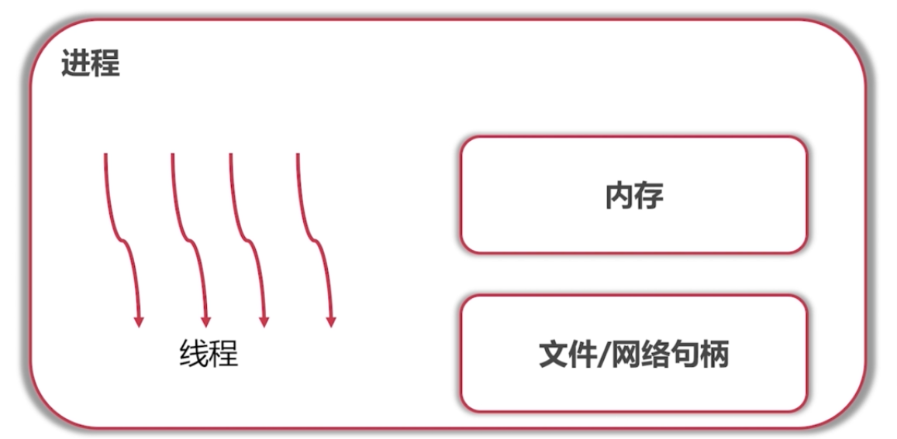
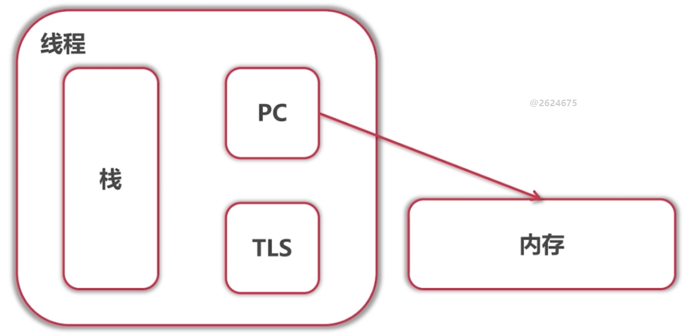
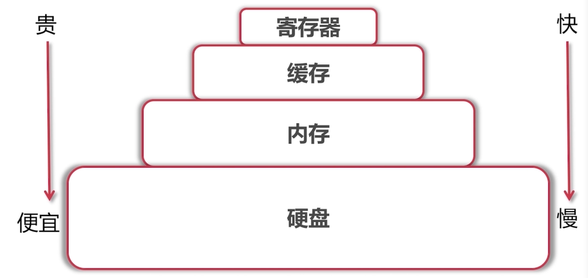
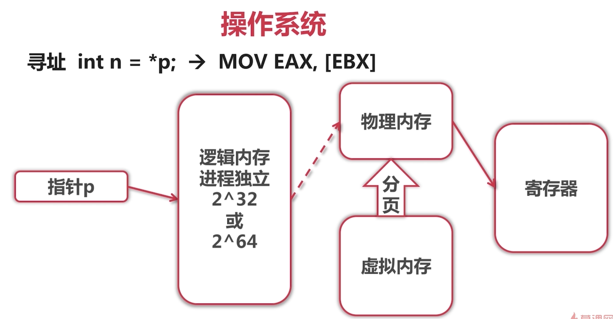
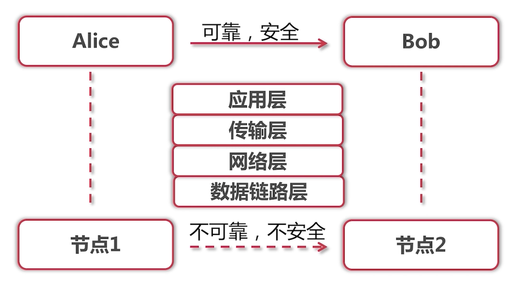
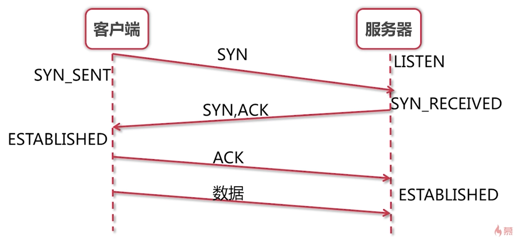
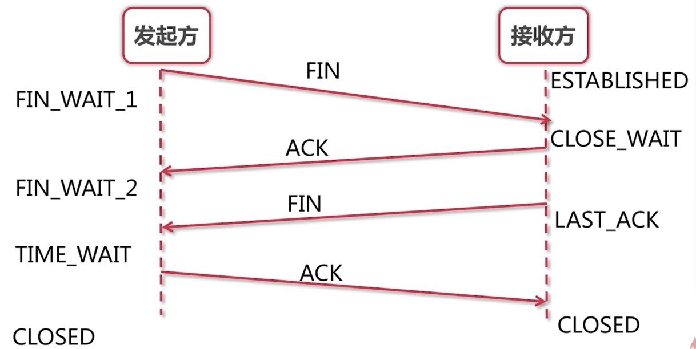

[TOC]


## 1 操作系统

### 进程和线程

- 了解面试者侧重点
- 进一步展开

进程之间不能共享内存，进程间通信方法有





### 存储和寻址

#### 存储



#### 寻址空间

32位      4G

64位      10^19Bytes

#### 寻址过程



### 进程间通信

#### 进程间通信的方法

##### 文件

##### signal

###### 示例1

Crtl + c

###### 示例2

```bash
#kill -l
kill -2 pid
# 效果同Ctrl + c
kill -9 pid
# 强制杀进程
```

##### 消息队列

##### 管道/命令管道

```bash
cat oki.log | grep "ERROR" --color
```

##### 共享内存

##### 同步机制

- 信号量

##### Socket

## 2 网络

### 网络基础



#### 网络传输

##### 不可靠

- 丢包，重复包
- 出错
- 乱序

##### 不安全

- 中间人攻击
- 窃取
- 篡改

### 滑动窗口问题

- TCP协议中使用，解决网络传输不可靠性
- 维持发送方/接收方缓冲区

### 网络抓包演示

### TCP链接建立与断开

#### 建立连接（三次握手），断开连接（四次挥手）

- 网络是不可靠的，任何包都有可能丢
- 遇见问题，解决问题，不断迭代

##### 建立连接（三次握手）




##### 断开连接（四次挥手）



## 3 数据库

### 关系型数据库

- 成：表结构不直观，实现复杂，速度慢
- 缺点：表结构不直观，实现复杂，速度慢
- 优点：健壮性高，社区庞大

### JOIN和GROUP BY

- 笛卡尔积
- group by 字段需要写在select语句中，select语句多配合聚合函数使用
- 子查询

```mysql
SELECT p.*, cat_min.categoryName FROM `product` p join (SELECT p.`categoryId`, p.`categoryName`, MIN(p.`price`)  AS min_price FROM `product` p JOIN `category` c on p.`categoryId` = c.`categoryId` GROUP BY p.`categoryId`, p.`categoryName`) AS cat_min on p.`categoryId` = cat_min.categoryId WHERE p.`price` = cat_min.min_price
```

### 事务和乐观锁

#### 事务

##### ACID属性

- Atomic
- Consistency
- Isolution
- Durability

##### 隔离级别

- Read Uncommitted
- Read Committed
- Repetable Reads
- Serializable

```mysql
# SET SESSION TRANSACTION ISOLATION LEVEL REPEATABLE READ;
BEGIN;
SET AUTOCOMMIT = 0;
SELECT @@tx_isolation;
SELECT count FROM `product` WHERE `productId` = 2;

SELECT count FROM `product` WHERE `productId` = 2 for update;
# 加行级锁

UPDATE `product` SET `count` = 49 WHERE `productId` = 2;
COMMIT;
# ROLLBACK;
```

#### 乐观锁

- 版本控制
- timestamp

```mysql
BEGIN;

SELECT count FROM `product` WHERE `productId` = 2;

UPDATE `product` SET `count` = 49 WHERE `productId` = 2 AND `count` = 50;

COMMIT;
```

### 数据库索引

#### 索引的创建和验证

- explain查看sql语句执行计划

#### 索引的实现

- B树
- B+树

### 数据库连接池

## 4 程序设计语言基础

### 程序语言设计归类

#### 类型检查

- 编译时：Java、Go...
- 运行时：Python、JavaScript...

#### 运行/编译

- 编译为机器代码运行：C、C++...
- 编译为中间代码，在虚拟机运行：Java、C#...
- 解释执行：Python、JavaScript...

#### 编程范式

- 面向过程：C、Visual Basic...
- 面向对象：Java、C++、C#...
- 函数式：Erlang...

## 5 编码技巧

### 数学归纳法

数学归纳法是编码的依据

### 递归书写方法

- 严格定义递归函数的作用，包括参数、返回值、Side-effect
- 先**一般**，后**特殊**
- 每次调用**必须**缩小问题的规模
- 每次问题规模缩小程度必须为1

#### 链表创建

```java
/**
 * Creates a linked list.
 *
 * @param data the data to create the list
 * @return head of the linked list. The returned linked list
 * ends with last node with getNext() == null.
 */
public <T> Node<T> createLinkedList(List<T> data) {
  if (data.isEmpty()) {
    return null;
  }

  Node<T> firstNode = new Node<>(data.get(0));
  firstNode.setNext(
      createLinkedList(data.subList(1, data.size())));
  return firstNode;
}
```

#### 链表反转

```java
/**
 * Reverses a linked list.
 *
 * @param head the linked list to reverse
 * @return head of the reversed linked list
 */
public <T> Node<T> reverseLinkedList(Node<T> head) {
  // size == 0 or size == 1
  if (head == null || head.getNext() == null) {
    return head;
  }

  Node<T> newHead = reverseLinkedList(head.getNext());
  head.getNext().setNext(head);
  head.setNext(null);
  return newHead;
}
```

#### 列出所有组合

```java
/**
 * Generates all combinations and output them,
 * selecting n elements from data.
 */
public void combinations(
    List<Integer> selected, List<Integer> data, int n) {
  if (n == 0) {
    // output all selected elements
    for (Integer i : selected) {
      System.out.print(i);
      System.out.print(" ");
    }
    System.out.println();
    return;
  }

  if (data.isEmpty()) {
    return;
  }

  // select element 0
  selected.add(data.get(0));
  combinations(selected, data.subList(1, data.size()), n - 1);

  // un-select element 0
  selected.remove(selected.size() - 1);
  combinations(selected, data.subList(1, data.size()), n);
}
```

### 循环书写方法

#### 循环不变式

- 是一句断言，定义各变量所满足的条件

#### 书写方法

- 定义循环不变式，并在循环体每次结束后**保持**循环不变式
- 先**一般**，后**特殊**
- 每次必须向前推进循环不变式中涉及的变量值
- 每次推进的规模**必须**为1

#### 链表反转

```java
public <T> Node<T> reverseLinkedList(Node<T> head) {
  Node<T> newHead = null;
  Node<T> curHead = head;
  // Loop invariant:
  // newHead points to the linked list already reversed.
  // curHead points to the linked list not yet reversed.

  // Loop invariant holds.
  while(curHead != null) {
    // Loop invariant holds.
    Node<T> next = curHead.getNext();
    curHead.setNext(newHead);
    newHead = curHead;
    curHead = next;
    // Loop invariant holds.
  }
  // Loop invariant holds.
  return newHead;
}
```

#### 链表删除节点

```java
public <T> Node<T> deleteIfEquals(Node<T> head, T value) {
  while (head != null && head.getValue() == value) {
    head = head.getNext();
  }

  if (head == null) {
    return null;
  }

  Node<T> prev = head;
  // Loop invariant: list nodes from head up to prev has been
  // processed. (Nodes with values equal to value are deleted.)
  while(prev.getNext() != null) {
    if (prev.getNext().getValue() == value) {
      // delete it
      prev.setNext(prev.getNext().getNext());
    } else {
      prev = prev.getNext();
    }
  }

  return head;
}
```

### 边界控制

#### 二分查找

在有序数组中查找元素k，返回k所在的下标

```java
/**
 * Searches element k in a sorted array.
 * @param arr a sorted array
 * @param k the element to search
 * @return index in arr where k is. -1 if not found.
 */
public int binarySearch(int[] arr, int k) {
  int a = 0;
  int b = arr.length;
  // Loop invariant: [a, b) is a valid range. (a <= b)
  // k may only be within range [a, b).
  while (a < b) {
    int m = a + (b - a) / 2; // m = (a + b) / 2 may overflow!
    if (k < arr[m]) {
      b = m;
    } else if (k > arr[m]) {
      a = m + 1;
    } else {
      return m;
    }
  }
  return -1;
}
```

### 数据结构回顾

#### 列表

- 数组
- 链表
- 队列和栈

#### 树

- 二叉树
- 搜索树
- 堆/优先队列

#### 栈/队列/优先队列

#### 图

- 无向图
- 有向图
- 有向无环图

#### 图的算法

- 深度优先遍历
- 广度优先遍历

### Java集合类常见问题

