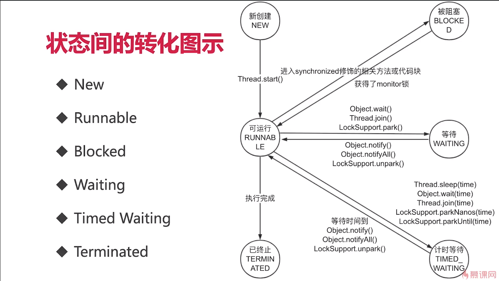

[TOC]

[面试题总结](https://docs.qq.com/doc/DSVNyZ2FNWWFkeFpO?_t=1625151373718)

## 创建线程常见面试问题 

### ~~1、有多少种实现多线程的方式？~~
1、从不同的角度看，会有不同的答案
2、典型答案是两种，分别是实现Runnable接口和继承Thread类
3、从原理上看，发现Thread类也实现了Runnable接口，并查看Thread类的run()方法，
   发现其实两者本质是一样的，run方法代码如下:

```java
	@Override
	public void run() {
		if (target != null) {
			target.run();
		}
	}
```
方法一和方法二,即"继承Thread类然后重写run()方法和实现Runnable接口并实现run()方法，在实现多线程的
本质上是没有区别的，
最终都是调用start()方法来启动线程。这两个方法最大的区别在于两个run()方法的内容来源：
方法一：最终调用target.run();
方法二：run()方法整个被重写了
4、具体展开说其他方式
	还有其他实现线程的方法，例如线程池等，他们也能新建线程，但细看源码，也没有逃离本质，
	也就是实现Runnable接口和继承Thread类。
5、结论
	我们只能通过新建Thread类这一种方式来创建线程，但类里面的run()方法有两种方式来实现，
	第一种是继承Thread类并重写run()方法，
	第二种是实现Runnable接口并实现run()方法，并将Runnable实例传给Thread类。
	除此之外，从表面上看，线程池、定时器等工具类也可以创建线程，但他们的本质也逃离不出刚才所说的范围。

### 2、实现Runnable接口和继承Thread类哪种方式更好？

1. 从代码架构角度：具体的任务（run方法）应该和“创建和运行线程的机制（Thread）类解耦”，使用Runnable对象可以实现解耦。
2. 使用继承Thread类方法，如果每次新建一个任务需要创建一个线程，线程创建和销毁的开销比较大；如果使用线程池+Runnable方式，可以大大减少损耗。
3. 由于Java不支持多继承，限制了扩展性。

## 启动线程常见面试问题 

### 1、一个线程两次调用start()方法会出现什么情况？为什么？

**start()方法源码**

```java
public synchronized void start() {
    /**
     * This method is not invoked for the main method thread or "system"
     * group threads created/set up by the VM. Any new functionality added
     * to this method in the future may have to also be added to the VM.
     *
     * A zero status value corresponds to state "NEW".
     */
    if (threadStatus != 0)
        throw new IllegalThreadStateException();

    /* Notify the group that this thread is about to be started
     * so that it can be added to the group's list of threads
     * and the group's unstarted count can be decremented. */
    group.add(this);

    boolean started = false;
    try {
        start0();
        started = true;
    } finally {
        try {
            if (!started) {
                group.threadStartFailed(this);
            }
        } catch (Throwable ignore) {
            /* do nothing. If start0 threw a Throwable then
              it will be passed up the call stack */
        }
    }
}
```

**流程**

1. 检查线程的状态是否为NEW，否则会抛出IllegalThreadStateException状态
2. 加入线程组
3. 调用start0()这个native方法

### 2、既然start()方法会调用run()方法，为什么选择调用start()方法，而不是直接调用run()方法呢？

start()方法才是真正启动一个线程，run()方法只是一个普通的方法而已，和线程的生命周期没有任何关系

## 停止线程常见面试问题 

### 1、如何停止线程？
	1、用interrupt来请求线程停止而不是强制，好处是安全。
	2、想停止线程，需要停止方、被停止方、子方法调用方相互配合才行：
		a)请求方：发出中断信号
		b)被停止方：每次循环或者适时的检查中断信号，并且在抛出InterruptedEXception地方处理该中断信号；
		c)子方法调用方（被线程调用的方法）：优先抛出InterruptedEXception，或者检测到中断信号时，再次设置中断信号；
	3、最后再说错误停止线程的方法：stop()、suspend()已废弃，volatile的boolean无法处理长时间阻塞的情况。
### 2、如何处理不可中断的阻塞？
	具体问题具体分析，尽量使用可以响应中断的方法。


​	
## 线程生命周期常见面试问题 

### 1、线程有几种状态？生命周期是什么？
	先讲6个圈内的状态名，再讲转换路径（例如：New只能跳转到Runnable），最后将转移条件。
	

### 2、阻塞状态的定义？
	一般而言，把Blocked(被阻塞)、Waiting(等待)、Timed_waiting(计时等待)都成为阻塞状态
	不仅仅是Blocked状态

## Thread和Object类常见面试问题 

### 1、wait和notify的基本用法代码演示 
	1. 研究代码执行顺序 
	2. 证明wait释放锁
```java
public class Wait {

    public static Object object = new Object();

    static class Thread1 extends Thread {

        @Override
        public void run() {
            synchronized (object) {
                System.out.println(Thread.currentThread().getName() + "开始执行了");
                try {
                    object.wait();
                } catch (InterruptedException e) {
                    e.printStackTrace();
                }
                System.out.println("线程" + Thread.currentThread().getName() + "获取到了锁。");
            }
        }
    }

    static class Thread2 extends Thread {

        @Override
        public void run() {
            synchronized (object) {
                object.notify();
                System.out.println("线程" + Thread.currentThread().getName() + "调用了notify()");
            }
        }
    }

    public static void main(String[] args) throws InterruptedException {
        Thread1 thread1 = new Thread1();
        Thread2 thread2 = new Thread2();
        thread1.start();
        Thread.sleep(200);
        thread2.start();
    }
}
```
### 2、两个线程交替打印0~100的奇偶数，用synchronized关键字实现
```java
public class WaitNotifyPrintOddEvenSyn {

    private static int count;

    private static final Object lock = new Object();

    //新建2个线程
    //1个只处理偶数，第二个只处理奇数（用位运算）
    //用synchronized来通信
    public static void main(String[] args) {
        new Thread(() -> {
            while (count < 100) {
                synchronized (lock) {
                    if ((count & 1) == 0) {
                        System.out.println(Thread.currentThread().getName() + "" + count++);
                    }
                }
            }
        }, "偶数").start();

        new Thread(() -> {
            while (count < 100) {
                synchronized (lock) {
                    if ((count & 1) == 1) {
                        System.out.println(Thread.currentThread().getName() + "" + count++);
                    }
                }
            }
        }, "奇数").start();
    }
}
```

### 3、两个线程交替打印0~100的奇偶数，用wait和notify实现
```java
public class WaitNotifyPrintOddEveWait {

    private static int count = 0;
    private static final Object lock = new Object();


    public static void main(String[] args) {
        new Thread(new TurningRunner(), "偶数").start();
        new Thread(new TurningRunner(), "奇数").start();
    }

    //1. 拿到锁，我们就打印
    //2. 打印完，唤醒其他线程，自己就休眠
    static class TurningRunner implements Runnable {

        @Override
        public void run() {
            while (count <= 100) {
                synchronized (lock) {
                    //拿到锁就打印
                    System.out.println(Thread.currentThread().getName() + "" + count++);
                    lock.notify();
                    if (count <= 100) {
                        try {
                            //如果任务还没结束，就让出当前的锁，并休眠
                            lock.wait();
                        } catch (InterruptedException e) {
                            e.printStackTrace();
                        }
                    }
                }
            }
        }
    }
}
```

### 4、手写生产者消费者模式,使wait/notify来实现
```java
public class ProducerConsumerModel {
    public static void main(String[] args) {
        EventStorage eventStorage = new EventStorage();
        Producer producer = new Producer(eventStorage);
        Consumer consumer = new Consumer(eventStorage);
        new Thread(producer).start();
        new Thread(consumer).start();
    }
}

class Producer implements Runnable {

    private EventStorage storage;

    public Producer(
            EventStorage storage) {
        this.storage = storage;
    }

    @Override
    public void run() {
        for (int i = 0; i < 100; i++) {
            storage.put();
        }
    }
}

class Consumer implements Runnable {

    private EventStorage storage;

    public Consumer(
            EventStorage storage) {
        this.storage = storage;
    }

    @Override
    public void run() {
        for (int i = 0; i < 100; i++) {
            storage.take();
        }
    }
}

class EventStorage {

    private int maxSize;
    private LinkedList<Date> storage;

    public EventStorage() {
        maxSize = 10;
        storage = new LinkedList<>();
    }

    public synchronized void put() {
        while (storage.size() == maxSize) {
            try {
                wait();
            } catch (InterruptedException e) {
                e.printStackTrace();
            }
        }
        storage.add(new Date());
        System.out.println("仓库里有了" + storage.size() + "个产品。");
        notify();
    }

    public synchronized void take() {
        while (storage.size() == 0) {
            try {
                wait();
            } catch (InterruptedException e) {
                e.printStackTrace();
            }
        }
        System.out.println("拿到了" + storage.poll() + "，现在仓库还剩下" + storage.size());
        notify();
    }
}
```
### 5、为什么wait()方法需要在同步代码块内使用，而sleep不需要？

### 6、为什么线程间通信的方法wait()、notify()、notifyAll()被定义在Object类里？而sleep定义在Thread类里？

### 7、wait()方法属于Object对象，如果使用Thread.wait()方法会怎样？


## 线程异常处理常见面试问题 
利用UncaughtExceptionHandler处理异常

### 1、Java异常体系

### 2、如何处理全局异常？为什么要全局处理？不处理行不行？

### 3、run()方法是否可以抛出异常？如果抛出异常，线程的状态会怎样？

### 4、线程中如何处理某个未处理异常？


## 线程安全常见面试问题 
- [ ] ### 1、线程安全问题之运行结果出错，演示计数不准确，并找出具体出错位置

```java
public class MultiThreadsError implements Runnable {

    static MultiThreadsError instance = new MultiThreadsError();
    int index = 0;
    static AtomicInteger realIndex = new AtomicInteger();
    static AtomicInteger wrongCount = new AtomicInteger();
    static volatile CyclicBarrier cyclicBarrier1 = new CyclicBarrier(2);
    static volatile CyclicBarrier cyclicBarrier2 = new CyclicBarrier(2);

    final boolean[] marked = new boolean[10000000];

    public static void main(String[] args) throws InterruptedException {

        Thread thread1 = new Thread(instance);
        Thread thread2 = new Thread(instance);
        thread1.start();
        thread2.start();
        thread1.join();
        thread2.join();
        System.out.println("表面上结果是" + instance.index);
        System.out.println("真正运行的次数" + realIndex.get());
        System.out.println("错误次数" + wrongCount.get());

    }

    @Override
    public void run() {
        marked[0] = true;
        for (int i = 0; i < 10000; i++) {
            try {
                cyclicBarrier2.reset();
                cyclicBarrier1.await();
            } catch (InterruptedException e) {
                e.printStackTrace();
            } catch (BrokenBarrierException e) {
                e.printStackTrace();
            }
            index++;
            try {
                cyclicBarrier1.reset();
                cyclicBarrier2.await();
            } catch (InterruptedException e) {
                e.printStackTrace();
            } catch (BrokenBarrierException e) {
                e.printStackTrace();
            }
            realIndex.incrementAndGet();
            synchronized (instance) {
                if (marked[index] && marked[index - 1]) {
                    System.out.println("发生错误" + index);
                    wrongCount.incrementAndGet();
                }
                marked[index] = true;
            }
        }
    }
}
```

### 2、线程安全问题之活跃性问题演示(死锁)
```java
public class MultiThreadError implements Runnable {

    int flag = 1;
    static Object o1 = new Object();
    static Object o2 = new Object();

    public static void main(String[] args) {
        MultiThreadError r1 = new MultiThreadError();
        MultiThreadError r2 = new MultiThreadError();
        r1.flag = 1;
        r2.flag = 0;
        new Thread(r1).start();
        new Thread(r2).start();
    }

    @Override
    public void run() {
        System.out.println("flag = " + flag);
        if (flag == 1) {
            synchronized (o1) {
                try {
                    Thread.sleep(500);
                } catch (InterruptedException e) {
                    e.printStackTrace();
                }
                synchronized (o2) {
                    System.out.println("1");
                }
            }
        }
        if (flag == 0) {
            synchronized (o2) {
                try {
                    Thread.sleep(500);
                } catch (InterruptedException e) {
                    e.printStackTrace();
                }
                synchronized (o1) {
                    System.out.println("0");
                }
            }
        }
    }
}
```

### 3、线程安全问题之对象发布逸出
```java
public class MultiThreadsError3 {

    private Map<String, String> states;

    public MultiThreadsError3() {
        states = new HashMap<>();
        states.put("1", "周一");
        states.put("2", "周二");
        states.put("3", "周三");
        states.put("4", "周四");
    }

    public Map<String, String> getStates() {
        return states;
    }

    public Map<String, String> getStatesImproved() {
        return new HashMap<>(states);
    }
}
```

### 4、线程安全问题之对象未完成初始化，发布对象（构造函数未初始化完毕就this赋值）
```java
public class MultiThreadsError4 {

    static Point point;
	
class Point {

    private final int x, y;

    public Point(int x, int y) throws InterruptedException {
        this.x = x;
        MultiThreadsError4.point = this;
        Thread.sleep(100);
        this.y = y;
    }

    @Override
    public String toString() {
        return x + "," + y;
    }
}

class PointMaker extends Thread {

    @Override
    public void run() {
        try {
            new Point(1, 1);
        } catch (InterruptedException e) {
            e.printStackTrace();
        }
    }
}
```

### 5、线程安全问题之对象未完成初始化，发布对象（构造函数中运行线程）
```java
public class MultiThreadsError6 {

    private Map<String, String> states;

    public MultiThreadsError6() {
        new Thread(new Runnable() {
            @Override
            public void run() {
                states = new HashMap<>();
                states.put("1", "周一");
                states.put("2", "周二");
                states.put("3", "周三");
                states.put("4", "周四");
            }
        }).start();
    }

    public Map<String, String> getStates() {
        return states;
    }
}
```

## JMM常见面试问题 

### 1、演示指令重排序
```java
public class OutOfOrderExecution {

    private static int x = 0, y = 0;
    private static int a = 0, b = 0;

    public static void main(String[] args) throws InterruptedException {
        int i = 0;
        for (; ; ) {
            i++;
            x = 0;
            y = 0;
            a = 0;
            b = 0;

            CountDownLatch latch = new CountDownLatch(3);

            Thread one = new Thread(new Runnable() {
                @Override
                public void run() {
                    try {
                        latch.countDown();
                        latch.await();
                    } catch (InterruptedException e) {
                        e.printStackTrace();
                    }
                    a = 1;
                    x = b;
                }
            });
            Thread two = new Thread(new Runnable() {
                @Override
                public void run() {
                    try {
                        latch.countDown();
                        latch.await();
                    } catch (InterruptedException e) {
                        e.printStackTrace();
                    }
                    b = 1;
                    y = a;
                }
            });
            two.start();
            one.start();
            latch.countDown();
            one.join();
            two.join();

            String result = "第" + i + "次（" + x + "," + y + ")";
            if (x == 0 && y == 0) {
                System.out.println(result);
                break;
            } else {
                System.out.println(result);
            }
        }
    }
}
```

### 2、Happens-Before规则有哪些？
	1、单线程规则
	2、锁操作（synchronized和lock）
	3、volatile变量
	4、线程启动
	5、线程join()
	6、传递性
	7、中断检测
	8、工具类的Happens-Before原则
		1、线程安全的容器get一定能够看到此前put等存入工作
		2、CountDownLatch
		3、Semaphore
		4、Future
		5、线程池
		6、CyclicBarrier

### 3、演示可见性问题(使用volatile关键字解决)
```java
public class FieldVisibility {

    volatile int a = 1;
    volatile int b = 2;

    private void change() {
        a = 3;
        b = a;
    }


    private void print() {
        System.out.println("b=" + b + ";a=" + a);
    }

    public static void main(String[] args) {
        while (true) {
            FieldVisibility test = new FieldVisibility();
            new Thread(new Runnable() {
                @Override
                public void run() {
                    try {
                        Thread.sleep(1);
                    } catch (InterruptedException e) {
                        e.printStackTrace();
                    }
                    test.change();
                }
            }).start();

            new Thread(new Runnable() {
                @Override
                public void run() {
                    try {
                        Thread.sleep(1);
                    } catch (InterruptedException e) {
                        e.printStackTrace();
                    }
                    test.print();
                }
            }).start();
        }

    }
}
```

### 4、演示可见性问题(使用synchronized关键字解决)
```java
public class FieldVisibilityABCD {

    int a = 1;
    int b = 2;
    int c = 2;
    int d = 2;

    private void change() {
        a = 3;
        b = 4;
        c = 5;
        synchronized (this) {
            d = 6;
        }
    }


    private void print() {
        synchronized (this) {
            int aa = a;
        }
        int bb = b;
        int cc = c;
        int dd = d;

        System.out.println("b=" + b + ";a=" + a);
    }

    public static void main(String[] args) {
        while (true) {
            FieldVisibilityABCD test = new FieldVisibilityABCD();
            new Thread(new Runnable() {
                @Override
                public void run() {
                    try {
                        Thread.sleep(1);
                    } catch (InterruptedException e) {
                        e.printStackTrace();
                    }
                    test.change();
                }
            }).start();

            new Thread(new Runnable() {
                @Override
                public void run() {
                    try {
                        Thread.sleep(1);
                    } catch (InterruptedException e) {
                        e.printStackTrace();
                    }
                    test.print();
                }
            }).start();
        }

    }
}
```

### 5、volatile关键字不适用场景之一（a++操作）
```java
public class NoVolatile implements Runnable {

    volatile int a;
    AtomicInteger realA = new AtomicInteger();

    public static void main(String[] args) throws InterruptedException {
        Runnable r =  new NoVolatile();
        Thread thread1 = new Thread(r);
        Thread thread2 = new Thread(r);
        thread1.start();
        thread2.start();
        thread1.join();
        thread2.join();
        System.out.println(((NoVolatile) r).a);
        System.out.println(((NoVolatile) r).realA.get());
    }
    @Override
    public void run() {
        for (int i = 0; i < 10000; i++) {
            a++;
            realA.incrementAndGet();
        }
    }
}
```

### 6、volatile关键字适用场景之一(纯赋值操作)
```java
public class UseVolatile1 implements Runnable {

    volatile boolean done = false;
    AtomicInteger realA = new AtomicInteger();

    public static void main(String[] args) throws InterruptedException {
        Runnable r =  new UseVolatile1();
        Thread thread1 = new Thread(r);
        Thread thread2 = new Thread(r);
        thread1.start();
        thread2.start();
        thread1.join();
        thread2.join();
        System.out.println(((UseVolatile1) r).done);
        System.out.println(((UseVolatile1) r).realA.get());
    }
    @Override
    public void run() {
        for (int i = 0; i < 10000; i++) {
            setDone();
            realA.incrementAndGet();
        }
    }

    private void setDone() {
        done = true;
    }
}
```
### 7、volatile关键字适用场景之二(触发器)

## 单例模式常见面试问题 

### 1、饿汉式（静态常量）（可用）

```java
public class Singleton1 {

    private final static Singleton1 INSTANCE = new Singleton1();

    private Singleton1() {}

    public static Singleton1 getInstance() {
        return INSTANCE;
    }
}
```

### 2、饿汉式（静态代码块）（可用）

```java
public class Singleton2 {

    private final static Singleton2 INSTANCE;

    static {
        INSTANCE = new Singleton2();
    }

    private Singleton2() {}

    public static Singleton2 getInstance() {
        return INSTANCE;
    }
}
```

### 3、懒汉式（线程不安全）

```java
public class Singleton3 {

    private static Singleton3 instance;

    private Singleton3() {}

    public static Singleton3 getInstance() {
        if (instance == null) {
            instance = new Singleton3();
        }
        return instance;
    }
}
```

### 4、懒汉式（线程安全）（不推荐）

```java
public class Singleton4 {

    private static Singleton4 instance;

    private Singleton4() {}

    public synchronized static Singleton4 getInstance() {
        if (instance == null) {
            instance = new Singleton4();
        }
        return instance;
    }
}
```

### 5、懒汉式（线程不安全）（不推荐）

```java
public class Singleton5 {

    private static Singleton5 instance;

    private Singleton5() {}

    public static Singleton5 getInstance() {
        if (instance == null) {
            synchronized (Singleton5.class) {
                instance = new Singleton5();
            }
        }
        return instance;
    }
}
```

### 6、双重检查（线程安全）（推荐面试使用）

```java
public class Singleton6 {

    private volatile static Singleton6 instance;

    private Singleton6() {}

    public static Singleton6 getInstance() {
        if (instance == null) {
            synchronized (Singleton6.class) {
                if (instance == null) {
                    instance = new Singleton6();
                }
            }
        }
        return instance;
    }
}
```

### 7、静态内部类方式（可用）

```java
public class Singleton7 {

    private Singleton7() {}

    private static class SingletonInstance {

        private static final Singleton7 INSTANCE = new Singleton7();
    }

    public static Singleton7 getInstance() {
        return SingletonInstance.INSTANCE;
    }
}
```

### 8、枚举单例（线程安全）（可用）

```java
public enum Singleton8 {
    INSTANCE;

    public void whatever() {}
}
```


## 死锁常见面试问题 

### 1、死锁的四个必要条件

​	1、互斥条件

​	2、请求与保持

​	3、不剥夺调价

​	4、循环等待

### 1、模拟多人随机转账代码演示

```java
public class MultiTransferMoney {

    private static final int NUM_ACCOUNTS = 500;
    private static final int NUM_MONEY = 1000;
    private static final int NUM_ITERATIONS = 1000000;
    private static final int NUM_THREADS = 20;

    public static void main(String[] args) {

        Random rnd = new Random();
        Account[] accounts = new Account[NUM_ACCOUNTS];
        for (int i = 0; i < accounts.length; i++) {
            accounts[i] = new Account(NUM_MONEY);
        }
        class TransferThread extends Thread {

            @Override
            public void run() {
                for (int i = 0; i < NUM_ITERATIONS; i++) {
                    int fromAcct = rnd.nextInt(NUM_ACCOUNTS);
                    int toAcct = rnd.nextInt(NUM_ACCOUNTS);
                    int amount = rnd.nextInt(NUM_MONEY);
                    TransferMoney.transferMoney(accounts[fromAcct], accounts[toAcct], amount);
                }
                System.out.println("运行结束");
            }
        }
        for (int i = 0; i < NUM_THREADS; i++) {
            new TransferThread().start();
        }
    }
}
```

```java
public class TransferMoney implements Runnable {

    int flag = 1;
    static Account a = new Account(500);
    static Account b = new Account(500);
    static Object lock = new Object();

    public static void main(String[] args) throws InterruptedException {
        TransferMoney r1 = new TransferMoney();
        TransferMoney r2 = new TransferMoney();
        r1.flag = 1;
        r2.flag = 0;
        Thread t1 = new Thread(r1);
        Thread t2 = new Thread(r2);
        t1.start();
        t2.start();
        t1.join();
        t2.join();
        System.out.println("a的余额" + a.balance);
        System.out.println("b的余额" + b.balance);
    }

    @Override
    public void run() {
        if (flag == 1) {
            transferMoney(a, b, 200);
        }
        if (flag == 0) {
            transferMoney(b, a, 200);
        }
    }

    public static void transferMoney(Account from, Account to, int amount) {
        class Helper {

            public void transfer() {
                if (from.balance - amount < 0) {
                    System.out.println("余额不足，转账失败。");
                    return;
                }
                from.balance -= amount;
                to.balance = to.balance + amount;
                System.out.println("成功转账" + amount + "元");
            }
        }
        int fromHash = System.identityHashCode(from);
        int toHash = System.identityHashCode(to);
        if (fromHash < toHash) {
            synchronized (from) {
                synchronized (to) {
                    new Helper().transfer();
                }
            }
        }
        else if (fromHash > toHash) {
            synchronized (to) {
                synchronized (from) {
                    new Helper().transfer();
                }
            }
        }else  {
            synchronized (lock) {
                synchronized (to) {
                    synchronized (from) {
                        new Helper().transfer();
                    }
                }
            }
        }

    }

    static class Account {

        public Account(int balance) {
            this.balance = balance;
        }

        int balance;
    }
}
```


### 2、哲学家就餐问题代码演示

```java
public class DiningPhilosophers {

    public static class Philosopher implements Runnable {

        private Object leftChopstick;

        public Philosopher(Object leftChopstick, Object rightChopstick) {
            this.leftChopstick = leftChopstick;
            this.rightChopstick = rightChopstick;
        }

        private Object rightChopstick;

        @Override
        public void run() {
            try {
                while (true) {
                    doAction("Thinking");
                    synchronized (leftChopstick) {
                        doAction("Picked up left chopstick");
                        synchronized (rightChopstick) {
                            doAction("Picked up right chopstick - eating");
                            doAction("Put down right chopstick");
                        }
                        doAction("Put down left chopstick");
                    }
                }
            } catch (InterruptedException e) {
                e.printStackTrace();
            }
        }

        private void doAction(String action) throws InterruptedException {
            System.out.println(Thread.currentThread().getName() + " " + action);
            Thread.sleep((long) (Math.random() * 10));
        }
    }

    public static void main(String[] args) {
        Philosopher[] philosophers = new Philosopher[5];
        Object[] chopsticks = new Object[philosophers.length];
        for (int i = 0; i < chopsticks.length; i++) {
            chopsticks[i] = new Object();
        }
        for (int i = 0; i < philosophers.length; i++) {
            Object leftChopstick = chopsticks[i];
            Object rightChopstick = chopsticks[(i + 1) % chopsticks.length];
            if (i == philosophers.length - 1) {
                philosophers[i] = new Philosopher(rightChopstick, leftChopstick);
            } else {
                philosophers[i] = new Philosopher(leftChopstick, rightChopstick);
            }
            new Thread(philosophers[i], "哲学家" + (i + 1) + "号").start();
        }
    }
}
```

### 3、使用tryLock避免死锁

```java
public class TryLockDeadlock implements Runnable {

    int flag = 1;
    static Lock lock1 = new ReentrantLock();
    static Lock lock2 = new ReentrantLock();

    public static void main(String[] args) {
        TryLockDeadlock r1 = new TryLockDeadlock();
        TryLockDeadlock r2 = new TryLockDeadlock();
        r1.flag = 1;
        r2.flag = 0;
        new Thread(r1).start();
        new Thread(r2).start();
    }

    @Override
    public void run() {
        for (int i = 0; i < 100; i++) {
            if (flag == 1) {
                try {
                    if (lock1.tryLock(800, TimeUnit.MILLISECONDS)) {
                        System.out.println("线程1获取到了锁1");
                        Thread.sleep(new Random().nextInt(1000));
                        if (lock2.tryLock(800, TimeUnit.MILLISECONDS)) {
                            System.out.println("线程1获取到了锁2");
                            System.out.println("线程1成功获取到了两把锁");
                            lock2.unlock();
                            lock1.unlock();
                            break;
                        } else {
                            System.out.println("线程1尝试获取锁2失败，已重试");
                            lock1.unlock();
                            Thread.sleep(new Random().nextInt(1000));
                        }
                    } else {
                        System.out.println("线程1获取锁1失败，已重试");
                    }
                } catch (InterruptedException e) {
                    e.printStackTrace();
                }
            }
            if (flag == 0) {
                try {
                    if (lock2.tryLock(3000, TimeUnit.MILLISECONDS)) {
                        System.out.println("线程2获取到了锁2");

                        Thread.sleep(new Random().nextInt(1000));
                        if (lock1.tryLock(3000, TimeUnit.MILLISECONDS)) {
                            System.out.println("线程2获取到了锁1");
                            System.out.println("线程2成功获取到了两把锁");
                            lock1.unlock();
                            lock2.unlock();
                            break;
                        } else {
                            System.out.println("线程2尝试获取锁1失败，已重试");
                            lock2.unlock();
                            Thread.sleep(new Random().nextInt(1000));
                        }
                    } else {
                        System.out.println("线程2获取锁2失败，已重试");
                    }
                } catch (InterruptedException e) {
                    e.printStackTrace();
                }
            }
        }
    }
}
```

### 4、演示活锁问题

```
public class LiveLock {

    static class Spoon {

        private Diner owner;

        public Spoon(Diner owner) {
            this.owner = owner;
        }

        public Diner getOwner() {
            return owner;
        }

        public void setOwner(Diner owner) {
            this.owner = owner;
        }

        public synchronized void use() {
            System.out.printf("%s吃完了!", owner.name);


        }
    }

    static class Diner {

        private String name;
        private boolean isHungry;

        public Diner(String name) {
            this.name = name;
            isHungry = true;
        }

        public void eatWith(Spoon spoon, Diner spouse) {
            while (isHungry) {
                if (spoon.owner != this) {
                    try {
                        Thread.sleep(1);
                    } catch (InterruptedException e) {
                        e.printStackTrace();
                    }
                    continue;
                }
                Random random = new Random();
                if (spouse.isHungry && random.nextInt(10) < 9) {
                    System.out.println(name + " 亲爱的" + spouse.name + "你先吃吧");
                    spoon.setOwner(spouse);
                    continue;
                }

                spoon.use();
                isHungry = false;
                System.out.println(name + " 我吃完了");
                spoon.setOwner(spouse);

            }
        }
    }


    public static void main(String[] args) {
        Diner husband = new Diner("牛郎");
        Diner wife = new Diner("织女");

        Spoon spoon = new Spoon(husband);

        new Thread(new Runnable() {
            @Override
            public void run() {
                husband.eatWith(spoon, wife);
            }
        }).start();

        new Thread(new Runnable() {
            @Override
            public void run() {
                wife.eatWith(spoon, husband);
            }
        }).start();
    }
}
```

